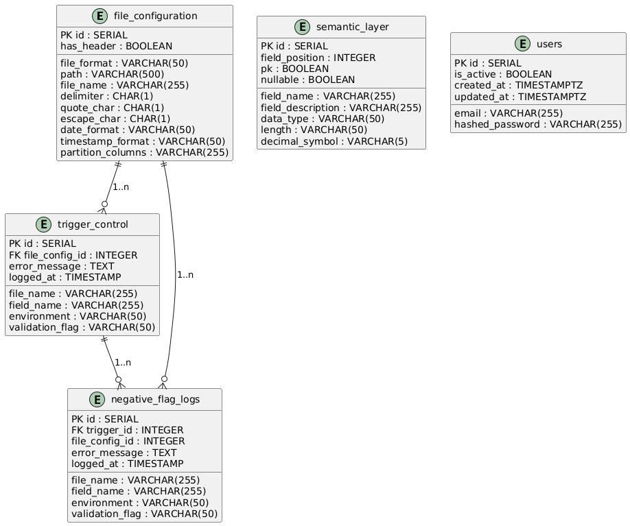
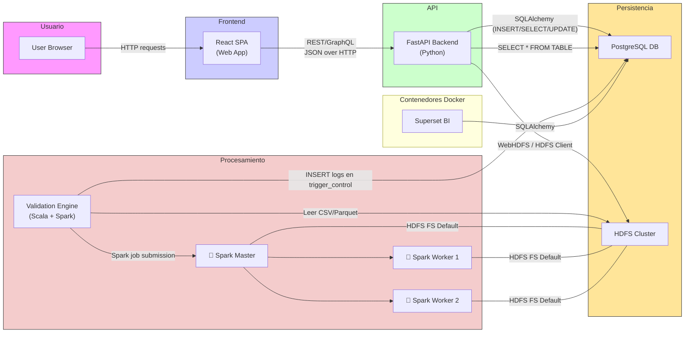

# File Monitoring System

> Documentación unificada del proyecto: motor de validaciones (Scala/Spark), frontend (React) y backend (FastAPI).

---

## Contenido

1. [Introducción](#1-introducción)

    1. [Resumen del proyecto](#11-resumen-del-proyecto)
    2. [Explicación de la aplicación](#12-explicación-de-la-aplicación)
    3. [Resumen de tecnologías utilizadas](#13-resumen-de-tecnologías-utilizadas)

2. [Especificación de Requisitos](#2-especificación-de-requisitos)

    1. [Requisitos funcionales](#21-requisitos-funcionales)
    2. [Requisitos no funcionales](#22-requisitos-no-funcionales)

3. [Diseño (Diagramas)](#3-diseño-diagramas)

    1. [Casos de uso](#31-casos-de-uso)
    2. [Diagrama entidad-relación](#32-diagrama-entidad-relación)
    3. [Esquema para BD no relacional](#33-esquema-para-bd-no-relacional)
    4. [Diagrama de clases del modelo](#34-diagrama-de-clases-del-modelo)
    5. [Diagramas de secuencia](#35-diagramas-de-secuencia)

4. [Implementación (GIT)](#4-implementación-git)

    1. [Diagrama de arquitectura](#41-diagrama-de-arquitectura)
    2. [Tecnologías](#42-tecnologías)
    3. [Código (Explicación de las partes más interesantes)](#43-código-explicación-de-las-partes-más-interesantes)
    4. [Organización del proyecto. Patrón](#44-organización-del-proyecto-patrón)

5. [Resultado (Manual de usuario)](#5-resultado-manual-de-usuario)

    1. [Requisitos previos](#51-requisitos-previos)
    2. [Pasos de uso](#52-pasos-de-uso)
    3. [Configuración adicional](#53-configuración-adicional)

6. [Conclusiones](#6-conclusiones)

    1. [Dificultades](#61-dificultades)
    2. [Mejoras](#62-mejoras)

---

## 1. Introducción

### 1.1 Resumen del proyecto

El **File Monitoring System** es una solución integral para la ingesta, validación y visualización de ficheros bancarios en un entorno Big Data. Consta de tres componentes principales:

1. Un **motor de validaciones** implementado en **Scala** y ejecutado sobre **Apache Spark**, que procesa ficheros almacenados en **HDFS**, aplica validaciones estructurales, tipológicas, referenciales y de negocio, y almacena los resultados en **PostgreSQL**.
2. Un **backend** desarrollado con **FastAPI** (Python 3.12) que expone una API REST para gestionar usuarios, configuraciones de ficheros, subir/descargar archivos y sincronizarlos con HDFS a través de **WebHDFS**.
3. Un **frontend** construido con **React 18+** y **Vite**, que permite al usuario autenticarse, subir CSV, editar metadatos de parseo, enviar ficheros a HDFS para validación y visualizar los logs resultantes.

La arquitectura está contenida en varios contenedores Docker orquestados mediante **Docker Compose**, incluyendo clúster Hadoop (NameNode/DataNode), Spark (Master/Workers), PostgreSQL, Kafka, Superset (opcional) y el propio motor de validaciones. El objetivo es ofrecer una solución escalable, modular y mantenible para garantizar la calidad e integridad de los datos bancarios.

### 1.2 Explicación de la aplicación

El flujo de trabajo global se describe a continuación:

1. **Usuario (frontend)**

    * Se registra o inicia sesión mediante JWT (FastAPI).
    * Accede a un dashboard donde puede subir un fichero CSV y gestionar metadatos de parseo (delimiter, quote\_char, date\_format, etc.).
    * Al pulsar “Validar”, el frontend envía el CSV al backend y éste lo almacena localmente y registra la configuración en la tabla `file_configuration` de PostgreSQL.

2. **Backend (FastAPI)**

    * Recibe el CSV (`POST /files/upload`) y guarda el archivo en la carpeta local `uploaded_files/`.
    * Crea o actualiza un registro en la tabla `file_configuration` con parámetros de parseo.
    * Cuando el usuario solicita “Enviar a HDFS” (`POST /files/push/{file_name}`), el backend:

        1. Verifica que el archivo existe en `uploaded_files/`.
        2. Llama a WebHDFS (NameNode) para crear el directorio `/data/bank_accounts` y ajustar permisos (`op=MKDIRS`, `op=SETPERM`).
        3. Solicita la creación del fichero en HDFS (`op=CREATE`), recuerda el redireccionamiento 307 a DataNode, ajusta la URL y sube el contenido.
        4. Responde al frontend con un mensaje de éxito.

3. **Motor de validaciones (Scala + Spark)**

    * Se ejecuta en un contenedor Docker con Spark y SBT. En el `ENTRYPOINT`, al arrancar:

        1. Ejecuta `hdfs dfsadmin -safemode leave` para salir de safe mode.
        2. Crea la carpeta `/data/bank_accounts` en HDFS (si no existe).
        3. Copia los CSV desde un volumen local (`/local_bank_accounts`) a HDFS.
        4. Inicia `spark-submit` que corre la clase `Main.scala`.
    * **Main.scala**:

        1. Configura un bucle de polling que observa el directorio HDFS (`/data/bank_accounts`).
        2. Al detectar un fichero, llama a `ExecutionManager.executeFile(path, outputTable)`.
        3. Dentro de `ExecutionManager`:

            * Lee el CSV con `Reader.readFile(...)` en un DataFrame particionado.
            * Aplica validadores en cascada:

                1. **FileSentinel**: validación estructural (delimitador, headers, número de columnas).
                2. **TypeValidator**: validación tipológica (tipos, rangos, formato de fecha, nullability).
                3. **ReferentialIntegrityValidator**: integridad referencial (unicidad de claves primarias según metadatos).
                4. **FunctionalValidator**: reglas de negocio (formato cuenta, rangos de credit\_score, balance según estado, etc.).
            * Si falla alguna validación, registra el flag correspondiente en la tabla `trigger_control` en PostgreSQL y detiene el procesamiento.
            * Si pasa todo, registra flag “2” (OK).
            * Borra el fichero de HDFS para evitar reprocesamientos.

4. **Base de datos (PostgreSQL)**

    * Contiene tablas:
        * `users`: para gestionar cuentas de usuario (backend y frontend).
        * `file_configuration`: configura parámetros de parseo de cada CSV.
        * `semantic_layer`: metadatos de cada campo (tipo de dato, longitud, nullable, PK, formato) utilizados en las validaciones tipológicas y referenciales.
        * `trigger_control`: almacena logs de validación (timestamp, file_config_id, field_name, environment, validation_flag, error_message).
        * `negative_flag_logs` (opcional): detalles adicionales de validaciones negativas.

5. **Visualización de resultados**

    * El usuario, desde el frontend, accede a `/logs` y obtiene los registros de validación (`GET /files/logs`).
    * El backend formatea la fecha (`logged_at`) al formato `DD/MM/YYYY, hh:mm:ss` en zona Madrid.
    * El frontend muestra una tabla con campos: ID, file\_config\_id, file\_name, field\_name, environment, validation\_flag, error\_message, fecha.

---

### 1.3 Resumen de tecnologías utilizadas

* **Scala 2.12**
* **Apache Spark 3.x** (Spark Streaming para procesamiento batch/near real‐time)
* **HDFS (Hadoop 3.x)**
* **SBT** (gestor de proyectos Scala)
* **Kryo** (serializador personalizado en Spark)
* **Docker & Docker Compose**

    * Contenedores: Spark Master/Workers (bitnami/spark), Hadoop NameNode/DataNode (bde2020), PostgreSQL (postgres\:latest), Kafka/Zookeeper (wurstmeister), Superset (dockerfile custom).
* **PostgreSQL 13** (logs y metadatos)
* **FastAPI** (Python 3.12)

    * **Uvicorn** (servidor ASGI)
    * **SQLAlchemy Async + AsyncPG**
    * **Pydantic Settings**
    * **python-jose**, **passlib\[bcrypt]** (JWT y hashing de contraseñas)
    * **requests** (llamadas a WebHDFS)
* **React 18+** (frontend) con **Vite**

    * **React Router v6**
    * **Axios** (con interceptores de token y 401)
    * **Context API** (AuthContext)
    * **CSS puro**
* **Superset** (opcional, para dashboards de logs)
* **Git / GitHub** (control de versiones)
* **PlantUML** (diagramas UML en bruto para generar ER, clases y secuencias)

---

## 2. Especificación de Requisitos

### 2.1 Requisitos funcionales

A continuación se listan los requisitos funcionales unificados, tomando en cuenta los tres componentes (frontend, backend, motor de validaciones):

1. **Autenticación de usuarios**

    * RF1.1: Registro de usuario con email y contraseña (`POST /auth/register`).
    * RF1.2: Login de usuario (`POST /auth/login`), devuelve JWT y redirige al dashboard.
    * RF1.3: Logout que elimina el token de `localStorage` y redirige a `/login`.
    * RF1.4: Cualquier petición protegida que retorne 401 Unauthorized debe borrar el token y redirigir a `/login`.

2. **Gestión de configuraciones de fichero (`file_configuration`)**

    * RF2.1: Subir CSV al backend (`POST /files/upload`) con `multipart/form-data`.
    * RF2.2: Al subir, insertar o actualizar parámetros en `file_configuration` (has\_header, delimiter, quote\_char, escape\_char, date\_format, timestamp\_format, partition\_columns).
    * RF2.3: Listar configuraciones (`GET /files/`), mostrar ID, file\_name, path, has\_header, delimiter, quote\_char, escape\_char, date\_format, timestamp\_format, partition\_columns.
    * RF2.4: Obtener detalles de una configuración (`GET /files/{id}`), editar parámetros (`PATCH /files/{id}`), eliminar configuración (`DELETE /files/{id}`).
    * RF2.5: Descargar CSV original desde backend (`GET /files/download/{file_name}`).

3. **Sincronización con HDFS**

    * RF3.1: Enviar fichero desde backend a HDFS (`POST /files/push/{file_name}`), creando directorio en HDFS (`op=MKDIRS`), ajustando permisos (`op=SETPERM`) y subiendo contenido (`op=CREATE`).
    * RF3.2: Backend debe manejar redireccionamiento 307 de NameNode a DataNode, adaptando la URL de destino.
    * RF3.3: Validar existencia local del fichero antes de empujar; si no existe, responder 404.

4. **Proceso de validación (motor Scala/Spark)**

    * RF4.1: Monitorizar HDFS en `/data/bank_accounts`; detectar nuevos ficheros en polling batch.
    * RF4.2: Por cada fichero detectado, procesarlo de forma independiente.
    * RF4.3: Validación estructural:

        * Verificar delimitador, encabezados y número de columnas según `file_configuration`.
        * Flags:

            * 32: Delimiter mismatch
            * 33: Header mismatch
            * 34: Column count per row mismatch
    * RF4.4: Validación tipológica:

        * Comprobar tipos, rangos (fechas, números), formatos de texto según `semantic_layer`.
        * Flags:

            * 35: Tipo inválido
            * 36: Nulo indebido
            * 37: Longitud excedida
            * 38: Formato texto inválido
    * RF4.5: Integridad referencial:

        * Verificar unicidad de claves primarias según metadatos.
        * Flag:

            * 39: Duplicado PK
    * RF4.6: Validación de negocio:

        * Reglas específicas del dominio bancario:

            * Formato de cuenta (`^[A-Za-z0-9]{10}$` → 40).
            * `credit_score` entre 300 y 850 → 41.
            * `risk_score` entre 0 y 100 → 42.
            * Mayor de 18 años (DOB) → 43.
            * Si `status`=“Active”, `balance`>=0; si “Closed”, `balance`=0 → 44/45.
            * Si `account_type`=“Checking”, `interest_rate`=0 → 46.
            * `overdraft_limit`>=0 y válido → 47.
            * Si `is_joint_account`=“Yes”, `num_transactions`>=2 → 48.
            * Si `num_transactions`=0, `avg_transaction_amount`=0 → 49.
    * RF4.7: Registrar resultados en `trigger_control` (timestamp, file\_config\_id, file\_name, field\_name, environment, validation\_flag, error\_message).
    * RF4.8: Tras procesar (OK o KO), borrar el fichero de HDFS para evitar reprocesamiento.

5. **Visualización de logs de validación**

    * RF5.1: Listar logs (`GET /files/logs`) filtrables por `environment`, `from_date` y `to_date`.
    * RF5.2: Formatear `logged_at` a `DD/MM/YYYY, hh:mm:ss` en zona Madrid.
    * RF5.3: Mostrar tabla con columnas: ID, file\_config\_id, file\_name, field\_name, environment, validation\_flag, error\_message, fecha.

6. **UX/UI del frontend**

    * RF6.1: Formularios de registro/login con validación de campos obligatorios.
    * RF6.2: Indicadores de carga en botones (“Subiendo…”, “Enviando…”, “Guardando…”, “Eliminando…”).
    * RF6.3: Modal de detalles que se cierra al hacer clic fuera o en botón “×”.
    * RF6.4: Alertas (`alert()`) para notificar éxito o error.
    * RF6.5: Navbar con enlaces en negrita (**Dashboard**, **Logs**) y botón **Logout** en color naranja.

---

### 2.2 Requisitos no funcionales

1. **Seguridad**

    * RNF1.1: JWT con expiración configurable; token almacenado en `localStorage`.
    * RNF1.2: Backend protege rutas con dependencia `get_current_user`; reacciona a 401 borrando token en frontend.
    * RNF1.3: HDFS: al crear directorios, aplicar `chmod -R 777` para permitir lectura/escritura a todos los usuarios.
    * RNF1.4: Contraseñas hasheadas con bcrypt.

2. **Rendimiento**

    * RNF2.1: El motor de validaciones debe procesar >1M filas por partición en < 1 minuto.
    * RNF2.2: Uso óptimo de particiones en Spark y `fetchSize` en conexiones JDBC.
    * RNF2.3: El frontend debe cargar en <2 s en producción básica.

3. **Escalabilidad**

    * RNF3.1: Motor de validaciones diseñado para aumentar nodos Spark sin cambios en el código.
    * RNF3.2: Backend asíncrono (FastAPI + SQLAlchemy Async) para operaciones I/O intensivo.
    * RNF3.3: Posibilidad de migrar a Spark Structured Streaming en el futuro.

4. **Disponibilidad**

    * RNF4.1: El motor debe mantenerse activo 24/7; al iniciar, ejecutar `hdfs dfsadmin -safemode leave`.
    * RNF4.2: Contenedores orquestados con Docker Compose deben reiniciarse automáticamente si fallan.

5. **Mantenibilidad**

    * RNF5.1: Arquitectura modular (SOLID, Clean Architecture).
    * RNF5.2: Código documentado con ScalaDoc (motor).
    * RNF5.3: Separación de capas (API, servicios, modelos, configuraciones) tanto en backend como en frontend.

6. **Compatibilidad**

    * RNF6.1: Frontend soporta navegadores modernos (Chrome, Firefox, Edge).
    * RNF6.2: No se requiere soporte para Internet Explorer.

7. **Tolerancia a fallos**

    * RNF7.1: Capturar excepciones en motor (sin detener el bucle principal) y registrar errores.
    * RNF7.2: En backend, manejar timeouts y errores de WebHDFS con lógica de reintentos básica.

---

## 3. Diseño (Diagramas)

> En la carpeta `docs/` se incluyen todos los diagramas en PNG o PlantUML; aquí se describen y referencian los más relevantes.

### 3.1 Casos de uso

A continuación se resumen los casos de uso principales para todo el sistema:

1. **Registrar Usuario**

    * **Actor:** Usuario no autenticado.
    * **Flujo:**

        1. Accede a `/register` (frontend).
        2. Completa email y contraseña, envía `POST /auth/register` (backend).
        3. Si éxito (201), frontend redirige a `/login`; si error, muestra mensaje en formulario.

2. **Iniciar Sesión**

    * **Actor:** Usuario no autenticado.
    * **Flujo:**

        1. Accede a `/login`.
        2. Completa credenciales, envía `POST /auth/login`.
        3. Si éxito (200), backend devuelve JWT; frontend guarda en `localStorage` y redirige a `/dashboard`.
        4. Si 401, muestra mensaje “Credenciales inválidas”.

3. **Cerrar Sesión**

    * **Actor:** Usuario autenticado.
    * **Flujo:**

        1. En navbar, pulsa **Logout**.
        2. Frontend elimina token y redirige a `/login`.

4. **Subir Fichero CSV**

    * **Actor:** Usuario autenticado.
    * **Flujo:**

        1. En `/dashboard`, selecciona CSV y pulsa **Subir Fichero**.
        2. Frontend muestra “Subiendo…”, envía `POST /files/upload` con `multipart/form-data`.
        3. Backend guarda el fichero en `uploaded_files/` y crea/actualiza registro en `file_configuration`.
        4. Backend responde `{ "file_config_id": X }`; frontend muestra alerta “Fichero subido ID: X” y refresca lista.

5. **Listar Configuraciones**

    * **Actor:** Usuario autenticado.
    * **Flujo:**

        1. Al acceder a `/dashboard`, frontend hace `GET /files/`.
        2. Backend devuelve array de configuraciones; frontend muestra tabla con cada fila: ID, file\_name, path, has\_header, delimiter, etc.

6. **Editar Configuración (Modal)**

    * **Actor:** Usuario autenticado.
    * **Flujo:**

        1. En `/dashboard`, pulsa **Detalles** en una fila.
        2. Abre modal con campos prellenados (`delimiter`, `quote_char`, `escape_char`, `has_header`, `date_format`, `timestamp_format`, `partition_columns`).
        3. Usuario modifica valores y pulsa **Guardar**; frontend muestra “Guardando…”, envía `PATCH /files/{id}`.
        4. Backend actualiza `file_configuration` y responde con objeto actualizado; frontend alerta “Configuración actualizada”, cierra modal y refresca lista.

7. **Eliminar Configuración**

    * **Actor:** Usuario autenticado.
    * **Flujo:**

        1. En `/dashboard` o modal, pulsa **Eliminar**.
        2. Mostrar `window.confirm("¿Estás seguro?")`.
        3. Si confirma, frontend muestra “Eliminando…”, envía `DELETE /files/{id}`.
        4. Backend elimina registro; responde 204; frontend alerta “Configuración eliminada” y refresca lista.

8. **Descargar Fichero**

    * **Actor:** Usuario autenticado.
    * **Flujo:**

        1. En modal, pulsa **Descargar**.
        2. Frontend hace `fetch(downloadURL, { headers: { Authorization: Bearer <token> } })`.
        3. Recibe Blob, crea `<a>` con `URL.createObjectURL(blob)` y `download=file_name`, ejecuta `a.click()`.
        4. Usuario obtiene el fichero en su equipo.

9. **Enviar Fichero a HDFS (Backend → HDFS)**

    * **Actor:** Usuario autenticado.
    * **Flujo:**

        1. En `/dashboard`, pulsa **Validar** en una fila; frontend muestra “Enviando…”, envía `POST /files/push/{file_name}`.
        2. Backend:

            * Verifica que `uploaded_files/{file_name}` exista; si no, responde 404.
            * Llama a WebHDFS NameNode para crear directorio `/data/bank_accounts` y ajustar permisos (`op=MKDIRS`, `op=SETPERM`).
            * Inicia creación de fichero (`op=CREATE`), recibe redirección 307 con URL de DataNode; ajusta host/puerto y sube contenido.
            * Devuelve `{ "message": "Pushed <file_name>" }`.
        3. Frontend alerta “Enviado a validar” y refresca lista.

10. **Proceso de validación en Spark (motor)**

    * **Actor:** Sistema (motor de validaciones).
    * **Flujo:**

        1. Motor arranca en contenedor Docker; sale de safe mode (`hdfs dfsadmin -safemode leave`), crea carpeta en HDFS y copia CSV.
        2. `Main.scala` ejecuta bucle de polling sobre `/data/bank_accounts`.
        3. Al detectar fichero, llama a `ExecutionManager.executeFile(path, outputTable)`.

            * `Reader.readFile(...)` carga CSV como DataFrame.
            * `FileSentinel.verifyFiles(...)` → si falla, `logTrigger(flag)` en `trigger_control` (flags 32,33,34).
            * `TypeValidator.verifyTyping(...)` → si falla, `logTrigger(...)` (flags 35-38).
            * `ReferentialIntegrityValidator.verifyIntegrity(...)` → si falla, `logTrigger(39)`.
            * `FunctionalValidator.verifyFunctional(...)` → si falla, `logTrigger(flags 40–49)`.
            * Si todo OK, `logTrigger(2)`.
        4. Borra el fichero de HDFS.

11. **Consultar Logs de Validación**

    * **Actor:** Usuario autenticado.
    * **Flujo:**

        1. Accede a `/logs`; frontend ejecuta `GET /files/logs?environment=&from_date=&to_date=`.
        2. Backend filtra registros en `trigger_control` según parámetros y devuelve array de logs.
        3. Frontend formatea `logged_at` con `toLocaleDateString('es-ES')` y muestra tabla con columnas: ID, file\_config\_id, file\_name, field\_name, environment, validation\_flag, error\_message, fecha.

*(Diagrams separados en ./docs/Engine, ./docs/Backend y ./docs/Frontend)*


---

### 3.2 Diagrama entidad-relación

**Tabla principal:** `trigger_control`

* `id (serial PK)`
* `logged_at (timestamp)`
* `file_config_id (int FK → file_configuration.id)`
* `file_name (varchar)`
* `field_name (varchar, null)`
* `environment (varchar)`
* `validation_flag (varchar)`
* `error_message (varchar, null)`

**Otras tablas relacionadas:**

* `file_configuration`

    * `id (serial PK)`
    * `file_format (varchar)`
    * `path (varchar)`
    * `file_name (varchar)`
    * `has_header (boolean)`
    * `delimiter (varchar)`
    * `quote_char (varchar)`
    * `escape_char (varchar)`
    * `date_format (varchar)`
    * `timestamp_format (varchar)`
    * `partition_columns (varchar, null)`
    * `created_by (int FK → users.id)`
    * `created_at (timestamp)`

* `semantic_layer`

    * `id (serial PK)`
    * `file_config_id (int FK → file_configuration.id)`
    * `field_name (varchar)`
    * `data_type (varchar)`
    * `length (int)`
    * `nullable (boolean)`
    * `is_pk (boolean)`
    * `format (varchar)`

* `users` (backend/front-end)

    * `id (serial PK)`
    * `email (varchar, unique)`
    * `hashed_password (varchar)`
    * `is_active (boolean, default true)`
    * `created_at (timestamp)`
    * `updated_at (timestamp)`

* `negative_flag_logs` (opcional)

    * `id (serial PK)`
    * `trigger_id (int FK → trigger_control.id)`
    * (otros campos de detalle)

**Relaciones:**

* `users` 1—\* `file_configuration` (un usuario puede tener varias configuraciones).
* `file_configuration` 1—\* `semantic_layer` (cada configuración define metadatos para múltiples campos).
* `file_configuration` 1—\* `trigger_control` (cada configuración genera múltiples logs de validación).
* `semantic_layer` (opcional) 1—\* `trigger_control` (para identificar qué campo en `trigger_control.field_name` proviene de qué metadato).
* `trigger_control` 1—\* `negative_flag_logs` (detalle de validaciones negativas).



*(Ver `docs/ERD.png` para la imagen completa.)*

---

### 3.3 Diagrama de clases del modelo

Se incluyen las clases más relevantes en los tres componentes.

#### 3.3.1 Motor de validaciones (Scala)

* **config**

    * `DbConfig.scala`
    * `DBConnection.scala`
    * `SparkSessionProvider.scala`

* **models**

    * `FileConfigurationCaseClass.scala`
    * `SemanticLayerCaseClass.scala`

* **services**

    * `ExecutionManager.scala`
    * `TriggerIdManager.scala`

* **utils**

    * `Reader.scala`
    * `Writer.scala`
    * `FileManager.scala`

* **validators**

    * `FileSentinel.scala`
    * `TypeValidator.scala`
    * `ReferentialIntegrityValidator.scala`
    * `FunctionalValidator.scala`

* **Main.scala**: configura el bucle de polling e invoca a `ExecutionManager`.

Ejemplo de case class:

```scala
package models

case class FileConfigurationCaseClass(
  id: Int,
  file_format: String,
  path: String,
  file_name: String,
  has_header: Boolean,
  delimiter: String,
  quote_char: String,
  escape_char: String,
  date_format: String,
  timestamp_format: String,
  partition_columns: Option[String]
)
```

*(Ver `./docs/Engine/` para la imagen completa.)*

---

#### 3.3.2 Frontend (React)

* **AuthContext.jsx**

    * Propiedades: `user`, `token`
    * Métodos: `login()`, `register()`, `logout()`
* **FileConfig (modelo JS)**

    * Propiedades: `id`, `fileName`, `path`, `hasHeader`, `delimiter`, `quoteChar`, `escapeChar`, `dateFormat`, `timestampFormat`, `partitionColumns`
    * Métodos: `fetchAll()`, `create()`, `update()`, `delete()`, `pushToHDFS()`, `download()`
* **ValidationLog (modelo JS)**

    * Propiedades: `id`, `fileConfigId`, `fileName`, `fieldName`, `environment`, `validationFlag`, `errorMessage`, `loggedAt`
    * Métodos: `fetchAll()`
* **Componentes principales**

    * `AppRouter` (gestiona rutas con `RequireAuth`)
    * `MainLayout` (Navbar + `<Outlet />`)
    * `Dashboard` (muestra lista de configuraciones y acciones)
    * `FileDetailModal` (modal para editar/validar/eliminar/descargar)
    * `LogsPage` (muestra logs formateando `logged_at`)

*(Ver `./docs/Frontend/` para la imagen completa.)*

---

#### 3.3.3 Backend (FastAPI)

* **models ORM (SQLAlchemy Async)**

    * `User`

        * `id: Integer PK`
        * `email: String(255) UNIQUE NOT NULL`
        * `hashed_password: String(255) NOT NULL`
        * `is_active: Boolean NOT NULL DEFAULT True`
        * `created_at: DateTime(timezone=True) DEFAULT now()`
        * `updated_at: DateTime(timezone=True)`
    * `FileConfiguration`

        * `id: Integer PK`
        * `file_format: String NOT NULL`
        * `path: String NOT NULL`
        * `file_name: String NOT NULL`
        * `has_header: Boolean NOT NULL`
        * `delimiter: String(1) NOT NULL`
        * `quote_char: String(1) NOT NULL`
        * `escape_char: String(1) NOT NULL`
        * `date_format: String NOT NULL`
        * `timestamp_format: String NOT NULL`
        * `partition_columns: String NULL`
    * `TriggerControl`

        * `id: Integer PK`
        * `file_config_id: Integer FK → FileConfiguration.id`
        * `file_name: String NOT NULL`
        * `field_name: String NOT NULL`
        * `environment: String NOT NULL`
        * `validation_flag: String NOT NULL`
        * `error_message: Text NULL`
        * `logged_at: DateTime(timezone=True) DEFAULT now()`
    * `NegativeFlagLog`

        * `id: Integer PK`
        * `trigger_id: Integer FK → TriggerControl.id`
        * (otros campos específicos)

* **Clases de servicio**

    * `file_service.py`

        * `save_and_register_file(file: UploadFile, db: AsyncSession) → int`
    * `hdfs_sync.py`

        * `push_file_to_hdfs(file_name: str)`

* **Controladores (routers)**

    * `auth.py`: `/auth/register`, `/auth/login`
    * `files.py`: `/files/upload`, `/files/push/{file_name}`, `/files/download/{file_name}`, `/files/`, `/files/{id}`, `/files/{id}` (GET, PATCH, DELETE), `/files/logs`
    * `health.py`: `/health` (healthcheck)

*(Ver `./docs/Backend/` para la imagen completa.)*

---

### 3.4 Diagramas de secuencia

Se incluyen los diagramas de secuencia más relevantes para cada componente. A continuación se describen de forma textual; ver `docs/` para los PNG o PlantUML.

#### 3.4.1 Secuencia: Subida de fichero (Frontend → Backend)

1. **Usuario → Dashboard (Frontend):** selecciona CSV y pulsa **Subir Fichero**.
2. **Dashboard → Axios (`POST /files/upload`):** envía `multipart/form-data` al backend.
3. **Backend (`files.py`) → `file_service.save_and_register_file()`:**

    * Guarda CSV en `uploaded_files/`.
    * Inserta/actualiza registro en `file_configuration`.
4. **Backend → Dashboard:** responde con `{ "file_config_id": X }` (201).
5. **Dashboard:** muestra alerta “Fichero subido ID: X” y llama `fetchConfigs()`.

#### 3.4.2 Secuencia: Enviar fichero a HDFS (Frontend → Backend → HDFS)

1. **Usuario → Dashboard:** pulsa **Validar**.
2. **Dashboard → Axios (`POST /files/push/{file_name}`):** solicita al backend empuje a HDFS.
3. **Backend (`files.py`) → `hdfs_sync.push_file_to_hdfs(file_name)`:**

    * Verifica existencia local en `uploaded_files/`.
    * Llama a WebHDFS NameNode (`MKDIRS`, `SETPERM`).
    * Llama `CREATE`, recibe 307 con header `Location` apuntando al DataNode.
    * Ajusta URL para apuntar a `hdfs_datanode_host:hdfs_datanode_port`.
    * Abre CSV y hace `PUT` a DataNode.
4. **HDFS DataNode → Backend:** responde 201 Created si éxito.
5. **Backend → Dashboard:** responde `{ "message": "Pushed <file_name>" }`.
6. **Dashboard:** muestra alerta “Enviado a validar” y llama `fetchConfigs()`.

#### 3.4.3 Secuencia: Proceso de validación en Spark (Motor)

1. **Contenedor `validation-engine` → HDFS:**

    * Ejecuta `hdfs dfsadmin -safemode leave`.
    * `hdfs dfs -mkdir -p /data/bank_accounts`.
    * `hdfs dfs -put -f /local_bank_accounts/*.csv /data/bank_accounts`.
    * Ajusta permisos `hdfs dfs -chmod -R 777 /data/bank_accounts`.
2. **Contenedor Spark (`spark-submit Main`) → HDFS.listStatus():** detecta CSV.
3. **Main → ExecutionManager.executeFile(path, outputTable):**

    * Llama `Reader.readFile(...)` → devuelve DataFrame particionado.
    * Llama `FileSentinel.verifyFiles(...)` → si falla, `logTrigger(flag)` y salir.
    * Llama `TypeValidator.verifyTyping(...)` → si falla, `logTrigger(flag)` y salir.
    * Llama `ReferentialIntegrityValidator.verifyIntegrity(...)` → si falla, `logTrigger(39)` y salir.
    * Llama `FunctionalValidator.verifyFunctional(...)` → si falla, `logTrigger(flags 40–49)` y salir.
    * Si todo OK, `logTrigger(2)`.
    * Escribe logs en PostgreSQL (`df.write.mode("append").jdbc(...)`).
    * `HDFS.delete(path)`.

#### 3.4.4 Secuencia: Listar Logs de Validación (Frontend → Backend → BD)

1. **Usuario → LogsPage (Frontend):** al montar, llama `getLogs()`.
2. **LogsPage → Axios (`GET /files/logs?environment=&from_date=&to_date=`):** solicita logs.
3. \*\*Backend (`files.py`) → consulta `trigger_control` filtrando por parámetros.
4. **Backend → LogsPage:** devuelve array de objetos JSON con campos de log.
5. **LogsPage:** recorre cada registro y formatea `logged_at` con `toLocaleDateString('es-ES')`.
6. **LogsPage:** muestra tabla con columnas: ID, file\_config\_id, file\_name, field\_name, environment, validation\_flag, error\_message, fecha.

---

## 4. Implementación (GIT)

### 4.1 Diagrama de arquitectura



* **Frontend (React + Vite)**

    * Usuario interactúa con la UI, llama rutas REST al backend y muestra datos.
* **Backend (FastAPI)**

    * Exposición de endpoints `/auth`, `/files`, `/files/logs`.
    * Usa **SQLAlchemy Async + AsyncPG** para comunicarse con PostgreSQL.
    * Utiliza **requests** para llamar a WebHDFS (NameNode/DataNode).
* **PostgreSQL**

    * Almacena `users`, `file_configuration`, `trigger_control`, `negative_flag_logs`.
    * Superset (opcional) también se conecta aquí para dashboards.
* **Motor Scala + Spark**

    * Se ejecuta como contenedor independiente, se conecta a HDFS (`hdfs://hadoop-namenode:9000`).
    * Procesa ficheros mediante Spark Streaming en modo batch y escribe logs en PostgreSQL mediante JDBC.
* **HDFS (NameNode/DataNode)**

    * Almacena CSV en `/data/bank_accounts`.
    * Motor de validaciones lee ficheros desde aquí y borra tras procesar.

*(Ver `docs/diagrama_arquitectura.png` para imagen detallada.)*

---

### 4.2 Tecnologías

A continuación se especifican todas las tecnologías y dependencias utilizadas en cada componente:

#### 4.2.1 Motor de validaciones (Scala + Spark)

* **Scala 2.12**
* **Apache Spark 3.x**
* **HDFS (Hadoop 3.x)**
* **SBT** (build tool de Scala)
* **Kryo** (serialización para Spark)
* **Docker** (OpenJDK 11-slim, bitnami/spark)
* **Docker Compose** (orquestación)

#### 4.2.2 Backend (FastAPI)

* **Python 3.12**
* **FastAPI >= 0.100.0**
* **Uvicorn\[standard] >= 0.23.0**
* **SQLAlchemy >= 2.0 (Async)**
* **asyncpg >= 0.28**
* **Pydantic Settings >= 2.0**
* **python-jose >= 3.3**
* **passlib\[bcrypt] >= 1.7**
* **requests >= 2.31**
* **python-dotenv >= 1.0**
* **Docker** (para ejecutar contenedores de backend en producción si se desea)

#### 4.2.3 Frontend (React)

* **React 18+**
* **React Router v6**
* **Axios**
* **Context API** (AuthContext)
* **Vite**
* **CSS puro**

#### 4.2.4 Base de datos y otros

* **PostgreSQL 13**
* **Kafka (opcional)**
* **Zookeeper (opcional)**
* **Superset** (opcional, para dashboards)
* **PlantUML** (diagramas de referencia)

---

### 4.3 Código (Explicación de las partes más interesantes)

Se destacan las implementaciones clave de cada componente.

#### 4.3.1 Motor de validaciones (Scala)

1. **`SparkSessionProvider.scala`**

    * Configura la `SparkSession` con parámetros personalizados:

      ```scala
      val spark = SparkSession.builder()
        .appName("ValidationEngine")
        .master("spark://spark-master:7077")
        .config("spark.serializer", "org.apache.spark.serializer.KryoSerializer")
        .config("spark.kryo.registrator", "com.mycompany.KryoRegistrator")
        .config("spark.hadoop.fs.defaultFS", "hdfs://hadoop-namenode:9000")
        .getOrCreate()
      ```
    * Ajusta particionamiento y directorios locales a través de `SPARK_LOCAL_DIRS`.

2. **`ExecutionManager.scala`**

    * Orquesta todas las validaciones:

      ```scala
      def executeFile(path: String, outputTable: String): Unit = {
        val df = Reader.readFile(spark, path)
        if (!FileSentinel.verifyFiles(df, metadata)) {
          logTrigger(flag, metadata, path)
          return
        }
        if (!TypeValidator.verifyTyping(df, metadata)) {
          logTrigger(flag, metadata, path)
          return
        }
        if (!ReferentialIntegrityValidator.verifyIntegrity(df, metadata)) {
          logTrigger(flag, metadata, path)
          return
        }
        FunctionalValidator.verifyFunctional(df, metadata) match {
          case Some(error) => 
            logTrigger(errorFlag, metadata, path)
            return
          case None => 
            logTrigger(2, metadata, path)
        }
        // Registrar en PostgreSQL
        Writer.writeToJdbc(df, outputTable, dbConfig)
        // Borrar de HDFS
        spark.sparkContext.hadoopConfiguration
          .delete(new Path(path), false)
      }
      ```
    * `logTrigger(flag, metadata, path)`: escribe un DataFrame con columns (`logged_at`, `file_config_id`, `file_name`, `field_name`, `environment`, `validation_flag`, `error_message`) y hace `df.write.mode("append").jdbc(...)`.

3. **Multi-Stage Dockerfile (`docker/Dockerfile.engine`)**

   ```dockerfile
   # Stage 1: Build con OpenJDK y SBT
   FROM openjdk:11-slim AS builder
   WORKDIR /app

   RUN apt-get update && apt-get install -y curl gnupg && \
       echo "deb https://repo.scala-sbt.org/scalasbt/debian all main" > /etc/apt/sources.list.d/sbt.list && \
       curl -sL "https://keyserver.ubuntu.com/pks/lookup?op=get&search=0x99E82A75642AC823" | apt-key add - && \
       apt-get update && apt-get install -y sbt && rm -rf /var/lib/apt/lists/*

   COPY ../project   project/
   COPY ../build.sbt build.sbt
   COPY ../src       src/
   COPY ../db.properties db.properties
   COPY ../src/main/resources/application.conf src/main/resources/

   RUN sbt clean assembly

   # Stage 2: Runtime Spark
   FROM bitnami/spark:3.3.1
   WORKDIR /app

   COPY --from=builder /app/target/scala-2.12/Fin_de_Grado-assembly-0.1.0-SNAPSHOT.jar app.jar
   COPY ../db.properties    db.properties
   COPY ../src/main/resources/application.conf application.conf

   ENV INPUT_DIR=/data/bank_accounts \
       OUTPUT_TABLE=trigger_control \
       POLL_INTERVAL_MS=10000 \
       SPARK_LOCAL_DIRS=/tmp/spark_local

   ENTRYPOINT spark-submit \
     --class Main \
     --master spark://spark-master:7077 \
     --deploy-mode client \
     --conf spark.driver.host=validation-engine \
     --conf spark.hadoop.fs.defaultFS=hdfs://hadoop-namenode:9000 \
     /app/app.jar
   ```

    * **Stage 1:** instala SBT, compila fat JAR con todas las dependencias.
    * **Stage 2:** parte de una imagen oficial de Spark; copia JAR, `db.properties` y `application.conf`; expone variables de entorno y lanza `spark-submit`.

4. **Script de reconstrucción (`scripts/rebuild_and_run.sh`)**

   ```bash
   #!/usr/bin/env bash
   set -euo pipefail

   # Construir el JAR con SBT
   sbt clean assembly

   # Crear red si no existe
   docker network create superset-net || true

   # Reconstruir y ejecutar solo el contenedor de validation-engine
   cd docker
   docker-compose build validation-engine
   docker-compose up --abort-on-container-exit validation-engine
   ```

    * Compila el JAR, crea la red `superset-net` y levanta únicamente el contenedor del motor de validaciones (asume que los demás servicios están corriendo).

---

#### 4.3.2 Backend (FastAPI)

1. **Configuración (`app/core/config.py`)**

   ```python
   from pydantic import BaseSettings

   class Settings(BaseSettings):
       postgres_user: str
       postgres_password: str
       postgres_host: str
       postgres_port: int
       postgres_db: str

       hdfs_host: str
       hdfs_port: int
       hdfs_dir: str
       hdfs_user: str
       hdfs_datanode_host: str
       hdfs_datanode_port: int

       upload_dir: str
       jwt_secret_key: str
       jwt_algorithm: str
       access_token_expire_minutes: int

       class Config:
           env_file = ".env"
   ```

    * Carga variables desde `.env` y construye `database_url = f"postgresql+asyncpg://{user}:{password}@{host}:{port}/{db}"`.

2. **Seguridad (`app/core/security.py`)**

   ```python
   from jose import JWTError, jwt
   from passlib.context import CryptContext
   from fastapi import Depends, HTTPException, status
   from fastapi.security import OAuth2PasswordBearer
   from sqlalchemy.ext.asyncio import AsyncSession
   from .config import Settings
   from app.db.models.user import UserModel

   pwd_context = CryptContext(schemes=["bcrypt"], deprecated="auto")
   oauth2_scheme = OAuth2PasswordBearer(tokenUrl="/auth/login")

   def verify_password(plain_password, hashed_password):
       return pwd_context.verify(plain_password, hashed_password)

   def get_password_hash(password):
       return pwd_context.hash(password)

   def create_access_token(subject: str, expires_delta=None):
       to_encode = {"sub": subject}
       # agregar expiración...
       encoded_jwt = jwt.encode(to_encode, Settings().jwt_secret_key, algorithm=Settings().jwt_algorithm)
       return encoded_jwt

   async def get_current_user(token: str = Depends(oauth2_scheme), db: AsyncSession = Depends(get_db)):
       credentials_exception = HTTPException(
           status_code=status.HTTP_401_UNAUTHORIZED,
           detail="No autenticado",
           headers={"WWW-Authenticate": "Bearer"},
       )
       try:
           payload = jwt.decode(token, Settings().jwt_secret_key, algorithms=[Settings().jwt_algorithm])
           user_id: str = payload.get("sub")
           if user_id is None:
               raise credentials_exception
       except JWTError:
           raise credentials_exception
       user = await db.get(UserModel, int(user_id))
       if user is None:
           raise credentials_exception
       return user
   ```

    * Define hashing de contraseñas, creación de JWT, y dependencia `get_current_user` que valida el token y extrae `sub`.

3. **Servicio de ficheros (`app/services/file_service.py`)**

   ```python
   import os
   from sqlalchemy.ext.asyncio import AsyncSession
   from app.db.models.file_configuration import FileConfigurationModel

   async def save_and_register_file(file, db: AsyncSession) -> int:
       upload_dir = Settings().upload_dir
       os.makedirs(upload_dir, exist_ok=True)
       file_path = os.path.join(upload_dir, file.filename)
       with open(file_path, "wb") as f:
           content = await file.read()
           f.write(content)
       result = await db.execute(select(FileConfigurationModel).where(FileConfigurationModel.file_name == file.filename))
       existing = result.scalar_one_or_none()
       if existing:
           # actualizar parámetros si vienen en request
           existing.some_field = ...
           await db.commit()
           return existing.id
       else:
           new_cfg = FileConfigurationModel(
               file_format="csv",
               path=upload_dir,
               file_name=file.filename,
               has_header=True,
               delimiter=",",
               quote_char='"',
               escape_char="\\",
               date_format="yyyy-MM-dd",
               timestamp_format="yyyy-MM-dd HH:mm:ss",
               partition_columns=None
           )
           db.add(new_cfg)
           await db.flush()
           return new_cfg.id
   ```

    * Guarda el CSV en disco local y crea/actualiza el registro en `file_configuration`.

4. **Servicio HDFS (`app/services/hdfs_sync.py`)**

   ```python
   import requests
   from fastapi import HTTPException
   from .config import Settings

   def push_file_to_hdfs(file_name: str):
       settings = Settings()
       local_path = os.path.join(settings.upload_dir, file_name)
       if not os.path.exists(local_path):
           raise HTTPException(status_code=404, detail=f"Local not found: {local_path}")

       # 1) MKDIRS
       mkdir_url = f"http://{settings.hdfs_host}:{settings.hdfs_port}/webhdfs/v1{settings.hdfs_dir}?op=MKDIRS&user.name={settings.hdfs_user}"
       resp = requests.put(mkdir_url)
       resp.raise_for_status()

       # 2) SETPERM
       perm_url = f"http://{settings.hdfs_host}:{settings.hdfs_port}/webhdfs/v1{settings.hdfs_dir}?op=SETPERM&permission=777&user.name={settings.hdfs_user}"
       resp = requests.put(perm_url)
       resp.raise_for_status()

       # 3) CREATE (NameNode → 307 → Location → DataNode)
       create_url = f"http://{settings.hdfs_host}:{settings.hdfs_port}/webhdfs/v1{settings.hdfs_dir}/{file_name}?op=CREATE&overwrite=true&user.name={settings.hdfs_user}"
       resp = requests.put(create_url, allow_redirects=False)
       location = resp.headers.get("Location")
       if not location:
           raise HTTPException(status_code=500, detail="HDFS create failed: no redirect")
       # Ajustar URL al DataNode
       upload_url = location.replace(f"{settings.hdfs_host}:{settings.hdfs_port}", f"{settings.hdfs_datanode_host}:{settings.hdfs_datanode_port}")
       with open(local_path, "rb") as f:
           resp2 = requests.put(upload_url, data=f)
           resp2.raise_for_status()
   ```

    * Gestiona la secuencia WebHDFS (MKDIRS, SETPERM, CREATE → 307 → PUT a DataNode).

5. **Rutas de archivos (`app/api/files.py`)**

   ```python
   from fastapi import APIRouter, Depends, UploadFile, File, HTTPException
   from sqlalchemy.ext.asyncio import AsyncSession
   from app.services.file_service import save_and_register_file
   from app.services.hdfs_sync import push_file_to_hdfs
   from app.db.session import get_db

   router = APIRouter(prefix="/files", tags=["files"])

   @router.post("/upload", status_code=201)
   async def upload_file(file: UploadFile = File(...), db: AsyncSession = Depends(get_db)):
       try:
           file_id = await save_and_register_file(file, db)
           return {"file_config_id": file_id}
       except Exception as e:
           raise HTTPException(status_code=500, detail=str(e))

   @router.post("/push/{file_name}")
   async def push_to_hdfs(file_name: str, user=Depends(get_current_user)):
       try:
           push_file_to_hdfs(file_name)
           return {"message": f"Pushed {file_name}"}
       except HTTPException as he:
           raise he
       except Exception as e:
           raise HTTPException(status_code=500, detail=str(e))

   @router.get("/")
   async def list_configs(db: AsyncSession = Depends(get_db)):
       result = await db.execute(select(FileConfigurationModel))
       configs = result.scalars().all()
       return configs

   @router.get("/{id}")
   async def get_config(id: int, db: AsyncSession = Depends(get_db)):
       cfg = await db.get(FileConfigurationModel, id)
       if not cfg:
           raise HTTPException(status_code=404, detail="Not found")
       return cfg

   @router.patch("/{id}")
   async def update_config(id: int, payload: FileConfigUpdate, db: AsyncSession = Depends(get_db)):
       cfg = await db.get(FileConfigurationModel, id)
       if not cfg:
           raise HTTPException(status_code=404, detail="Not found")
       for key, val in payload.dict(exclude_unset=True).items():
           setattr(cfg, key, val)
       await db.commit()
       return cfg

   @router.delete("/{id}", status_code=204)
   async def delete_config(id: int, db: AsyncSession = Depends(get_db)):
       cfg = await db.get(FileConfigurationModel, id)
       if not cfg:
           raise HTTPException(status_code=404, detail="Not found")
       await db.delete(cfg)
       await db.commit()

   @router.get("/download/{file_name}")
   async def download_file(file_name: str):
       file_path = os.path.join(Settings().upload_dir, file_name)
       if not os.path.exists(file_path):
           raise HTTPException(status_code=404, detail="File not found")
       return FileResponse(file_path, media_type="text/csv", filename=file_name)

   @router.get("/logs")
   async def get_logs(environment: str = None, from_date: date = None, to_date: date = None, db: AsyncSession = Depends(get_db)):
       query = select(TriggerControlModel)
       if environment:
           query = query.where(TriggerControlModel.environment == environment)
       if from_date:
           query = query.where(TriggerControlModel.logged_at >= from_date)
       if to_date:
           query = query.where(TriggerControlModel.logged_at <= to_date)
       result = await db.execute(query.order_by(TriggerControlModel.logged_at.desc()))
       logs = result.scalars().all()
       return logs
   ```

    * Endpoints para CRUD de configuraciones, subida, push a HDFS, descarga y consulta de logs.

---

#### 4.3.3 Frontend (React + Vite)

1. **Configuración de Axios (`src/api/axiosConfig.js`)**

   ```js
   import axios from 'axios';

   const api = axios.create({
     baseURL: 'http://localhost:8000',
   });

   // Interceptor de petición: añade token si existe
   api.interceptors.request.use(config => {
     const token = localStorage.getItem('access_token');
     if (token) {
       config.headers.Authorization = `Bearer ${token}`;
     }
     return config;
   });

   // Interceptor de respuesta: si 401, borrar token y redirigir
   api.interceptors.response.use(
     response => response,
     error => {
       if (error.response && error.response.status === 401) {
         localStorage.removeItem('access_token');
         alert('Tu sesión ha expirado. Por favor, inicia sesión de nuevo.');
         window.location.href = '/login';
       }
       return Promise.reject(error);
     }
   );

   export default api;
   ```

    * Gestiona token en cada petición y maneja 401 automáticamente.

2. **`AuthContext.jsx`**

   ```jsx
   import React, { createContext, useState, useEffect } from 'react';
   import { useNavigate } from 'react-router-dom';
   import api from '../api/axiosConfig';

   export const AuthContext = createContext();

   export const AuthProvider = ({ children }) => {
     const [token, setToken] = useState(localStorage.getItem('access_token'));
     const navigate = useNavigate();

     useEffect(() => {
       if (token) {
         localStorage.setItem('access_token', token);
       } else {
         localStorage.removeItem('access_token');
       }
     }, [token]);

     const login = async (email, password) => {
       const res = await api.post('/auth/login', { email, password });
       setToken(res.data.access_token);
       navigate('/dashboard');
     };

     const register = async (email, password) => {
       await api.post('/auth/register', { email, password });
       navigate('/login');
     };

     const logout = () => {
       setToken(null);
       navigate('/login');
     };

     return (
       <AuthContext.Provider value={{ token, login, register, logout }}>
         {children}
       </AuthContext.Provider>
     );
   };
   ```

    * Gestiona estado global de autenticación y métodos `login()`, `register()`, `logout()`.

3. **`AppRouter.jsx`**

   ```jsx
   import React, { useContext } from 'react';
   import { BrowserRouter, Routes, Route, Navigate, useLocation } from 'react-router-dom';
   import { AuthContext } from '../contexts/AuthContext';
   import LoginPage from '../pages/LoginPage';
   import RegisterPage from '../pages/RegisterPage';
   import Dashboard from '../pages/Dashboard';
   import LogsPage from '../pages/LogsPage';
   import MainLayout from '../layouts/MainLayout';

   const RequireAuth = ({ children }) => {
     const { token } = useContext(AuthContext);
     const location = useLocation();
     return token ? children : <Navigate to="/login" state={{ from: location }} replace />;
   };

   const AppRouter = () => (
     <BrowserRouter>
       <Routes>
         <Route path="/login" element={<LoginPage />} />
         <Route path="/register" element={<RegisterPage />} />
         <Route path="/" element={<RequireAuth><MainLayout /></RequireAuth>}>
           <Route index element={<Navigate to="/dashboard" replace />} />
           <Route path="dashboard" element={<Dashboard />} />
           <Route path="logs" element={<LogsPage />} />
         </Route>
         <Route path="*" element={<Navigate to="/login" replace />} />
       </Routes>
     </BrowserRouter>
   );

   export default AppRouter;
   ```

    * Define rutas públicas (`/login`, `/register`) y privadas (`/dashboard`, `/logs`) con `RequireAuth`.

4. **`Dashboard.jsx`**

   ```jsx
   import React, { useState, useEffect, useContext } from 'react';
   import { AuthContext } from '../contexts/AuthContext';
   import api from '../api/axiosConfig';
   import FileDetailModal from '../components/FileDetailModal';

   const Dashboard = () => {
     const [configs, setConfigs] = useState([]);
     const [selectedFile, setSelectedFile] = useState(null);
     const [uploading, setUploading] = useState(false);
     const [showModal, setShowModal] = useState(false);
     const [currentConfig, setCurrentConfig] = useState(null);

     const fetchConfigs = async () => {
       const res = await api.get('/files/');
       setConfigs(res.data);
     };

     useEffect(() => {
       fetchConfigs();
     }, []);

     const handleUpload = async () => {
       if (!selectedFile) return;
       setUploading(true);
       const form = new FormData();
       form.append('file', selectedFile);
       const res = await api.post('/files/upload', form);
       alert(`Fichero subido ID: ${res.data.file_config_id}`);
       fetchConfigs();
       setUploading(false);
     };

     const handleValidate = async (fileName) => {
       await api.post(`/files/push/${fileName}`);
       alert('Enviado a validar');
       fetchConfigs();
     };

     const handleDelete = async (id) => {
       if (!window.confirm('¿Estás seguro?')) return;
       await api.delete(`/files/${id}`);
       alert('Configuración eliminada');
       fetchConfigs();
     };

     return (
       <div>
         <h2>Dashboard</h2>
         <input type="file" onChange={e => setSelectedFile(e.target.files[0])} />
         <button onClick={handleUpload} disabled={uploading}>
           {uploading ? 'Subiendo...' : 'Subir Fichero'}
         </button>
         <table>
           <thead>
             <tr>
               <th>ID</th>
               <th>Fichero</th>
               <th>Has Header</th>
               <th>Delimiter</th>
               <th>Acciones</th>
             </tr>
           </thead>
           <tbody>
             {configs.map(cfg => (
               <tr key={cfg.id}>
                 <td>{cfg.id}</td>
                 <td>{cfg.file_name}</td>
                 <td>{cfg.has_header ? 'Sí' : 'No'}</td>
                 <td>{cfg.delimiter}</td>
                 <td>
                   <button onClick={() => handleValidate(cfg.file_name)}>Enviando…</button>
                   <button onClick={() => { setCurrentConfig(cfg); setShowModal(true); }}>Detalles</button>
                   <button onClick={() => handleDelete(cfg.id)}>Eliminar</button>
                 </td>
               </tr>
             ))}
           </tbody>
         </table>
         {showModal && (
           <FileDetailModal
             config={currentConfig}
             onClose={() => setShowModal(false)}
             onRefresh={fetchConfigs}
           />
         )}
       </div>
     );
   };

   export default Dashboard;
   ```

    * Subida de fichero, lista de configuraciones con acciones (Validar, Detalles, Eliminar).

5. **`FileDetailModal.jsx`**

   ```jsx
   import React, { useState } from 'react';
   import api from '../api/axiosConfig';

   const FileDetailModal = ({ config, onClose, onRefresh }) => {
     const [delimiter, setDelimiter] = useState(config.delimiter);
     const [quoteChar, setQuoteChar] = useState(config.quote_char);
     const [escapeChar, setEscapeChar] = useState(config.escape_char);
     const [hasHeader, setHasHeader] = useState(config.has_header);
     const [dateFormat, setDateFormat] = useState(config.date_format);
     const [timestampFormat, setTimestampFormat] = useState(config.timestamp_format);
     const [partitionColumns, setPartitionColumns] = useState(config.partition_columns);
     const [saving, setSaving] = useState(false);
     const [validating, setValidating] = useState(false);
     const [deleting, setDeleting] = useState(false);

     const save = async () => {
       setSaving(true);
       await api.patch(`/files/${config.id}`, {
         delimiter, quote_char: quoteChar, escape_char: escapeChar,
         has_header: hasHeader, date_format: dateFormat,
         timestamp_format: timestampFormat, partition_columns: partitionColumns
       });
       alert('Configuración actualizada');
       setSaving(false);
       onClose();
       onRefresh();
     };

     const validate = async () => {
       setValidating(true);
       await api.post(`/files/push/${config.file_name}`);
       alert('Enviado a validar');
       setValidating(false);
       onClose();
       onRefresh();
     };

     const downloadFile = async () => {
       const res = await fetch(`http://localhost:8000/files/download/${config.file_name}`, {
         headers: { Authorization: `Bearer ${localStorage.getItem('access_token')}` }
       });
       const blob = await res.blob();
       const url = URL.createObjectURL(blob);
       const a = document.createElement('a');
       a.href = url;
       a.download = config.file_name;
       a.click();
       URL.revokeObjectURL(url);
     };

     const remove = async () => {
       if (!window.confirm('¿Estás seguro?')) return;
       setDeleting(true);
       await api.delete(`/files/${config.id}`);
       alert('Configuración eliminada');
       setDeleting(false);
       onClose();
       onRefresh();
     };

     const overlayStyle = {
       position: 'fixed', top: 0, left: 0, right: 0, bottom: 0,
       backgroundColor: 'rgba(0,0,0,0.5)', display: 'flex',
       justifyContent: 'center', alignItems: 'center'
     };
     const modalStyle = {
       background: '#fff', padding: '1rem', borderRadius: '8px',
       position: 'relative', width: '500px'
     };

     return (
       <div style={overlayStyle} onClick={onClose}>
         <div style={modalStyle} onClick={e => e.stopPropagation()}>
           <h3>Detalles Fichero</h3>
           <label>Delimiter:</label>
           <select value={delimiter} onChange={e => setDelimiter(e.target.value)}>
             <option value=",">Comma</option>
             <option value=";">Semicolon</option>
             <option value="\t">Tab</option>
             <option value="|">Pipe</option>
           </select>
           <label>Quote Character:</label>
           <select value={quoteChar} onChange={e => setQuoteChar(e.target.value)}>
             <option value={'"'}>Double</option>
             <option value="'">Single</option>
             <option value="">None</option>
           </select>
           <label>Escape Character:</label>
           <select value={escapeChar} onChange={e => setEscapeChar(e.target.value)}>
             <option value="\\">Backslash</option>
             <option value={'"'}>Double</option>
             <option value="">None</option>
           </select>
           <label>Has Header:</label>
           <input type="checkbox" checked={hasHeader} onChange={e => setHasHeader(e.target.checked)} />
           <label>Date Format:</label>
           <select value={dateFormat} onChange={e => setDateFormat(e.target.value)}>
             <option value="yyyy-MM-dd">YYYY-MM-DD</option>
             <option value="dd/MM/yyyy">DD/MM/YYYY</option>
             <option value="MM-dd-yyyy">MM-DD-YYYY</option>
           </select>
           <label>Timestamp Format:</label>
           <select value={timestampFormat} onChange={e => setTimestampFormat(e.target.value)}>
             <option value="yyyy-MM-dd HH:mm:ss">YYYY-MM-DD HH:mm:ss</option>
             <option value="ISO 8601">ISO 8601</option>
             <option value="Timestamp MS">Timestamp MS</option>
           </select>
           <label>Partition Columns:</label>
           <input
             type="text"
             value={partitionColumns || ''}
             onChange={e => setPartitionColumns(e.target.value)}
           />
           <div style={{ marginTop: '1rem' }}>
             <button onClick={save} disabled={saving}>
               {saving ? 'Guardando...' : 'Guardar'}
             </button>
             <button onClick={validate} disabled={validating}>
               {validating ? 'Enviando…' : 'Validar'}
             </button>
             <button onClick={downloadFile}>Descargar</button>
             <button onClick={remove} disabled={deleting}>
               {deleting ? 'Eliminando…' : 'Eliminar'}
             </button>
           </div>
           <button onClick={onClose} style={{ position: 'absolute', top: '8px', right: '8px' }}>×</button>
         </div>
       </div>
     );
   };

   export default FileDetailModal;
   ```

    * Modal para editar parámetros, validar, descargar y eliminar configuración.

6. **`LogsPage.jsx`**

   ```jsx
   import React, { useState, useEffect } from 'react';
   import api from '../api/axiosConfig';

   const LogsPage = () => {
     const [logs, setLogs] = useState([]);

     const fetchLogs = async () => {
       const res = await api.get('/files/logs');
       setLogs(res.data);
     };

     useEffect(() => {
       fetchLogs();
     }, []);

     return (
       <div>
         <h2>Logs de Validación</h2>
         <table>
           <thead>
             <tr>
               <th>ID</th>
               <th>Config ID</th>
               <th>Fichero</th>
               <th>Campo</th>
               <th>Entorno</th>
               <th>Flag</th>
               <th>Mensaje</th>
               <th>Fecha</th>
             </tr>
           </thead>
           <tbody>
             {logs.map(l => (
               <tr key={l.id}>
                 <td>{l.id}</td>
                 <td>{l.file_config_id}</td>
                 <td>{l.file_name}</td>
                 <td>{l.field_name}</td>
                 <td>{l.environment}</td>
                 <td>{l.validation_flag}</td>
                 <td>{l.error_message}</td>
                 <td>{new Date(l.logged_at).toLocaleDateString('es-ES')}</td>
               </tr>
             ))}
           </tbody>
         </table>
       </div>
     );
   };

   export default LogsPage;
   ```

    * Muestra los logs de validación y formatea la fecha a español.

---

### 4.4 Organización del proyecto. Patrón

Se propone la siguiente estructura monolítica (tres carpetas principales), aunque cada componente puede colocarse en repositorios separados según conveniencia:

```
FileMonitoringSystem/
├── backend/                            ← Código FastAPI
│   ├── app/
│   │   ├── api/
│   │   │   ├── auth.py
│   │   │   ├── files.py
│   │   │   └── health.py
│   │   ├── core/
│   │   │   ├── config.py
│   │   │   └── security.py
│   │   ├── db/
│   │   │   ├── base.py
│   │   │   ├── session.py
│   │   │   └── models/
│   │   │       ├── user.py
│   │   │       ├── file_configuration.py
│   │   │       ├── semantic_layer.py      ← metadatos de campos
│   │   │       ├── trigger_control.py
│   │   │       └── negative_flag_logs.py
│   │   ├── services/
│   │   │   ├── file_service.py
│   │   │   └── hdfs_sync.py
│   │   └── schemas/
│   │       ├── auth.py
│   │       ├── files.py
│   │       └── logs.py
│   ├── main.py
│   ├── .env
│   ├── requirements.txt
│   └── test_api.sh
│
├── frontend/                           ← Código React + Vite
│   ├── public/
│   │   └── index.html
│   ├── src/
│   │   ├── api/
│   │   │   └── axiosConfig.js
│   │   ├── components/
│   │   │   └── FileDetailModal.jsx
│   │   ├── contexts/
│   │   │   └── AuthContext.jsx
│   │   ├── layouts/
│   │   │   └── MainLayout.jsx
│   │   ├── pages/
│   │   │   ├── Dashboard.jsx
│   │   │   ├── LoginPage.jsx
│   │   │   ├── RegisterPage.jsx
│   │   │   └── LogsPage.jsx
│   │   ├── routes/
│   │   │   └── AppRouter.jsx
│   │   ├── styles/
│   │   │   └── index.css
│   │   └── main.jsx
│   ├── package.json
│   └── README.md
│
├── engine/                             ← Motor de validaciones Scala + Spark
│   ├── docker/
│   │   ├── Dockerfile.engine
│   │   ├── Dockerfile.superset
│   │   └── docker-compose.yml
│   ├── docs/                           ← Diagramas PNG
│   │   ├── diagrama_casos_de_uso.png
│   │   ├── ERD.png
│   │   ├── diagrama_clases.png
│   │   ├── diagrama_secuencia.png
│   │   └── ...
│   ├── scripts/
│   │   └── rebuild_and_run.sh
│   ├── src/
│   │   ├── main/
│   │   │   ├── resources/
│   │   │   │   ├── application.conf
│   │   │   │   ├── db.properties
│   │   │   │   └── files/                ← Scripts Python para generar CSV de prueba
│   │   │   └── scala/
│   │   │       ├── Main.scala
│   │   │       ├── config/
│   │   │       │   ├── DbConfig.scala
│   │   │       │   ├── DBConnection.scala
│   │   │       │   └── SparkSessionProvider.scala
│   │   │       ├── models/
│   │   │       │   ├── FileConfigurationCaseClass.scala
│   │   │       │   └── SemanticLayerCaseClass.scala
│   │   │       ├── services/
│   │   │       │   ├── ExecutionManager.scala
│   │   │       │   └── TriggerIdManager.scala
│   │   │       ├── utils/
│   │   │       │   ├── Reader.scala
│   │   │       │   ├── Writer.scala
│   │   │       │   └── FileManager.scala
│   │   │       └── validators/
│   │   │           ├── FileSentinel.scala
│   │   │           ├── TypeValidator.scala
│   │   │           ├── ReferentialIntegrityValidator.scala
│   │   │           └── FunctionalValidator.scala
│   │   ├── test/scala/                 ← Pruebas unitarias (ScalaTest)
│   │   └── build.sbt
│   └── README-cluster.md               ← Guía de cluster Hadoop/Spark/Kafka/Superset
│
├── docs/                               ← Carpeta MkDocs (documentación “libro”)
│   ├── 01-introduccion.md
│   ├── 02-requisitos.md
│   ├── 03-diseno.md
│   ├── 04-implementacion.md
│   ├── 05-resultado.md
│   ├── 06-conclusiones.md
│   └── img/
│       ├── diagrama_casos_de_uso.png
│       ├── ERD.png
│       ├── diagrama_clases.png
│       ├── diagrama_secuencia.png
│       └── ... (otros PNG)
│
├── mkdocs.yml                          ← Configuración de MkDocs
├── .github/
│   └── workflows/
│       └── mkdocs-deploy.yml           ← GitHub Action para desplegar en Pages
│
└── README-cluster.md                   ← Guía de cluster (si quieres)  
```

* El patrón es **feature-based**: cada carpeta agrupa archivos según responsabilidad (API, servicios, modelos, diagramas, etc.).
* Cada componente puede versionarse por separado y luego combinarse en un monorepo si se desea.

---

## 5. Resultado (Manual de usuario)

### 5.1 Requisitos previos

Requisitos comunes:

* **Docker Desktop** (Linux, macOS o Windows) con **160 GB** libres en disco.
* **Docker Compose** (versión ≥ 1.27).
* **Node.js v16+** y **npm** (para frontend).
* **Python 3.12**, **pip** (para backend).
* Clonar el repositorio:

  ```bash
  git clone https://github.com/JuanraDAM/FileMonitoringSystem.git
  cd FileMonitoringSystem
  ```

#### 5.1.1 Motor de validaciones

* Espacio en disco para contenedores Hadoop/Spark y datos HDFS.
* Puertos:

    * **9000** (NameNode)
    * **9870** (NameNode UI)
    * **9864** (DataNode)
    * **7077** (Spark Master)
    * **8080** (Spark Master UI)
    * **8081, 8082** (Spark Workers UI)
* **SBT** instalado localmente si se desea compilar sin Docker.

#### 5.1.2 Backend (FastAPI)

* Crear entorno virtual Python 3.12:

  ```bash
  python3.12 -m venv backend/.venv
  source backend/.venv/bin/activate
  pip install --upgrade pip
  pip install -r backend/requirements.txt 
  ```
* Archivo `.env` en `backend/` con credenciales y configuración de HDFS.

#### 5.1.3 Frontend (React)

* Desde `frontend/`:

  ```bash
  cd frontend
  npm install
  ```
* No hay variables de entorno adicionales, asume que el backend corre en `http://localhost:8000`.

---

### 5.2 Pasos de uso

A continuación se describen los pasos para levantar cada componente y usar el sistema completo.

#### 5.2.1 Levantar infraestructura con Docker Compose

1. **Ir a la carpeta del motor**:

   ```bash
   cd engine/docker
   ```

2. **Crear la red Docker** (si no existe):

   ```bash
   docker network create superset-net || true
   ```

3. **Levantar todos los servicios**:

   ```bash
   docker-compose up -d
   ```

   Esto arrancará:

    * PostgreSQL (para Superset y tablas de validación).
    * Superset (opcional, UI de dashboards).
    * Zookeeper + Kafka (opcional).
    * Hadoop NameNode + DataNode.
    * Spark Master + Spark Workers.
    * Contenedor `validation-engine` (motor de validaciones).

4. **Verificar estado**:

   ```bash
   docker-compose ps
   ```

    * Esperar a que contenedores se vuelvan `healthy`.
    * Si HDFS arranca en safe mode, `validation-engine` ejecutará automáticamente `hdfs dfsadmin -safemode leave`.

#### 5.2.2 Inicializar el backend (FastAPI)

1. Entrar a la carpeta `backend/`:

   ```bash
   cd ../../backend
   source .venv/bin/activate
   ```
2. Ejecutar migraciones o crear tablas manualmente (no incluidas en el proyecto, usar tu propia estrategia).
3. Levantar el servidor local:

   ```bash
   uvicorn main:app --reload --host 0.0.0.0 --port 8000
   ```

    * La API estará disponible en `http://localhost:8000`.
    * Endpoints principales:

        * `/auth/register`
        * `/auth/login`
        * `/files/upload`
        * `/files/push/{file_name}`
        * `/files/download/{file_name}`
        * `/files/` (GET, POST, PATCH, DELETE)
        * `/files/logs`

#### 5.2.3 Inicializar el frontend (React)

1. En otra terminal, entrar a `frontend/`:

   ```bash
   cd ../frontend
   ```
2. Instalar dependencias (si no se hizo antes):

   ```bash
   npm install
   ```
3. Levantar el servidor de desarrollo:

   ```bash
   npm run dev
   ```
4. Abrir el navegador en `http://localhost:5173`.

#### 5.2.4 Flujo de usuario

1. **Registro/Login**

    * Acceder a `http://localhost:5173/register` para crear cuenta.
    * Luego `http://localhost:5173/login` para iniciar sesión.

2. **Dashboard**

    * Subir CSV: seleccionar un archivo y pulsar **Subir Fichero**.
    * Aparecerá alerta con el ID de configuración.
    * La tabla mostrará todas las configuraciones; cada fila ofrece botones:

        * **Validar**: envía el CSV a HDFS y lanza validación en Spark.
        * **Detalles**: abre modal para editar metadatos, validar, descargar o eliminar.
        * **Eliminar**: borra configuración de la base de datos.

3. **Visualizar logs**

    * Acceder a `http://localhost:5173/logs` para ver resultados de validación.
    * La tabla mostrará los últimos logs, con fecha formateada a `DD/MM/YYYY`.

4. **Superset (opcional)**

    * Superset corre en `http://localhost:8088`.
    * Iniciar sesión con credenciales creadas en `docker-compose.yml` (admin / 1234).
    * Configurar una conexión a PostgreSQL (`superset-db:5432`) para leer tablas `trigger_control` y crear dashboards de calidad de datos.

---

### 5.3 Configuración adicional

1. **Variables de entorno (backend)**

    * En `backend/.env`:

      ```
      # PostgreSQL
      POSTGRES_USER=superset
      POSTGRES_PASSWORD=superset
      POSTGRES_HOST=postgres
      POSTGRES_PORT=5432
      POSTGRES_DB=superset
 
      # HDFS
      HDFS_HOST=hadoop-namenode
      HDFS_PORT=9870
      HDFS_DIR=/data/bank_accounts
      HDFS_USER=hdfs
      HDFS_DATANODE_HOST=hadoop-datanode
      HDFS_DATANODE_PORT=9864
 
      # Carpeta local de uploads
      UPLOAD_DIR=uploaded_files
 
      # JWT
      JWT_SECRET_KEY=TuSecretoUltraSeguro123!
      JWT_ALGORITHM=HS256
      ACCESS_TOKEN_EXPIRE_MINUTES=60
      ```

2. **Permisos en HDFS**

    * El contenedor `validation-engine` se encarga de ajustar permisos con `hdfs dfs -chmod -R 777 /data/bank_accounts`.
    * Si se prefiere, desde cualquier contenedor con cliente Hadoop:

      ```bash
      hdfs dfs -chmod -R 777 /data/bank_accounts
      ```

3. **Descargas y backups**

    * Para exportar la base de datos PostgreSQL:

      ```bash
      docker exec -t superset-db pg_dumpall -c -U superset > dump_$(date +%F).sql
      ```
    * Para restaurar:

      ```bash
      docker exec -i superset-db psql -U superset < dump_YYYY-MM-DD.sql
      ```

4. **Personalizar Spark**

    * Variables de entorno para Spark Master/Workers (en `docker-compose.yml`):

        * `SPARK_WORKER_MEMORY`, `SPARK_WORKER_CORES`, `SPARK_LOCAL_DIRS`.
    * Ajustar `spark.executor.memory` y `spark.driver.memory` en `spark-submit` si se procesan CSV muy grandes.

---

## 6. Conclusiones

### 6.1 Dificultades

1. **ClusterID incompatibles (HDFS)**

    * Al cambiar o recrear imágenes de Hadoop, DataNode arroja error de “Incompatible clusterIDs”.
    * Solución: borrar volúmenes `hadoop-namenode` y `hdfs-data-datanode` antes de levantar.

2. **Safe Mode en HDFS**

    * HDFS arranca en “safe mode” si detecta inconsistencias o falta de bloques.
    * Se incorporó `hdfs dfsadmin -safemode leave` en el contenedor `validation-engine` para forzar la salida.

3. **Manejo de redirección en WebHDFS**

    * WebHDFS devuelve un redirect 307 con URL del DataNode; ajustar host y puerto es crítico.
    * Se debió detectar y procesar manualmente el header `Location` antes de subir el contenido.

4. **Tamaño de ficheros grandes**

    * Al probar con CSV de varios GB, los DataNode se quedaban sin espacio y se excluían.
    * Se recomendó montar `/tmp` de Spark Workers en volúmenes dedicados (`docker_validation_tmp`) o usar `tmpfs`.

5. **Coordinación entre frontend y backend (token y rutas)**

    * La gestión de 401 Unauthorized requirió interceptores en Axios para borrar token y redirigir a login.
    * Asegurarse de que todas las peticiones protegidas incluyeran el header `Authorization`.

6. **Configuración de permisos HDFS desde FastAPI**

    * Ejecutar comandos Hadoop desde contenedor Python (shell) generaba a veces problemas de path.
    * Se optó por usar HTTP WebHDFS en lugar de comandos nativos en Python.

7. **SQLAlchemy Async y migraciones**

    * Cambios frecuentes en el modelo de datos (por ejemplo, `TIMESTAMP` a `TIMESTAMPTZ`) implicaron migraciones manuales.
    * No se incluyó un sistema de migraciones (Alembic), por lo que hubo que recrear tablas en producción.

8. **Paginación y filtros en logs**

    * Al crecer el número de logs, la consulta simple (`SELECT * FROM trigger_control`) se volvía lenta.
    * Se implementaron filtros por fecha y entorno, pero falta paginación y límites por defecto.

9. **Interfaz de usuario básica**

    * Al usar CSS puro, costó diseñar un estilo consistente y responsivo.
    * Se recomendó integrar un framework CSS (Tailwind, Material UI) para mejorar UX/UI.

---

### 6.2 Mejoras

1. **Migrar a Spark Structured Streaming**

    * Pasar de polling batch a procesamiento near‐real‐time con Structured Streaming y checkpoints.

2. **Orquestación con Kubernetes**

    * Desplegar Hadoop, Spark y el motor de validaciones en un clúster Kubernetes usando Helm charts y StatefulSets.
    * Facilitar elasticidad y escalado automático de nodos.

3. **Monitorización con Prometheus & Grafana**

    * Exponer métricas de Spark, HDFS y PostgreSQL.
    * Crear dashboards de latencia, tasas de error y uso de recursos.

4. **Alertas automáticas**

    * Enviar notificaciones por correo o webhook cuando ocurran validaciones negativas (flags críticos).

5. **Paginación y filtros avanzados en frontend**

    * Añadir paginación en listas de configuraciones y logs.
    * Filtros por fecha, entorno, flag de validación, nombre de fichero.

6. **Soporte para formatos adicionales**

    * Añadir validación y lectura de CSV comprimidos, Parquet, Avro u ORC.
    * Implementar validaciones basadas en schemas Avro o JSON Schema.

7. **Carga fragmentada (chunked upload)**

    * Para CSV muy grandes, usar multipart upload o chunking en frontend/backend para evitar timeouts.

8. **Integración de notificaciones en tiempo real**

    * Usar WebSockets o WebPubSub para notificar al frontend sobre el estado de la validación en tiempo real.

9. **Internacionalización (i18n)**

    * Permitir cambiar idioma en frontend (ES, EN).
    * Formateo de fechas y mensajes localizados.

10. **Documentación de API con Swagger/Redoc**

    * FastAPI ya genera documentación automática; extenderla con ejemplos de petición/respuesta y código de errores.

---

## Anexo: Glosario de Flags

|          Rango         | Significado                                      |
| :--------------------: | :----------------------------------------------- |
|           30           | Error de lectura (I/O, CSV mal formado)          |
|           32           | Delimiter mismatch (número de columnas esperado) |
|           33           | Header mismatch (encabezados distintos)          |
|           34           | Column count per row mismatch                    |
|           35           | Tipo inválido                                    |
|           36           | Nulo indebido                                    |
|           37           | Longitud excedida                                |
|           38           | Formato texto inválido                           |
|           39           | Duplicado PK (integridad referencial)            |
|           40           | Formato inválido (`account_number`)              |
|           41           | Fuera de rango (`credit_score`)                  |
|           42           | Fuera de rango (`risk_score`)                    |
|           43           | Menor de edad (`date_of_birth`)                  |
|           44           | Negativo en “Active” (`balance`)                 |
|           45           | Balance ≠ 0 en “Closed”                          |
|           46           | Interest ≠ 0 en “Checking”                       |
|           47           | Overdraft inválido                               |
|           48           | Pocas transacciones en joint                     |
|           49           | Avg tx ≠ 0 con 0 tx                              |
| 1.13, 1.21, 1.31, 1.41 | Flags de validación “todo OK” (sin errores)      |
|            2           | OK final (todos los validadores pasaron)         |
|           99           | Sin configuración en `file_configuration`        |

---

