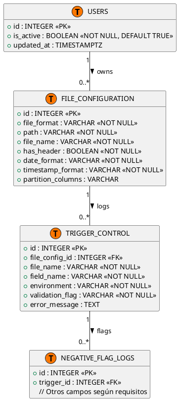
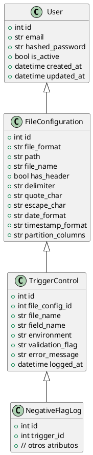

# Microservicio de Monitorización de Ficheros

## 1. Introducción

### 1.1 Resumen del proyecto

Este proyecto implementa un **microservicio REST** cuya finalidad es gestionar el ciclo de vida de ficheros CSV en un entorno de análisis de datos. Proporciona:

* Subida segura de ficheros CSV.
* Configuración de parámetros de parseo (delimitadores, formatos de fecha, columnas de partición).
* Sincronización de los CSV con un cluster HDFS a través de WebHDFS.
* Registro de logs de validación en base de datos tras el procesamiento.

El objetivo es ofrecer una solución modular y escalable, centrada en la ingesta de datos para posteriores análisis en un ecosistema Big Data.

### 1.2 Explicación de la aplicación

La aplicación se organiza en tres capas:

1. **API (FastAPI)**

   * Expone rutas RESTful para registro y autenticación de usuarios, subida y descarga de ficheros, configuración de parseo y envío de CSV a HDFS.
   * Protege rutas mediante JWT.
   * Realiza llamadas a los servicios de negocio y devuelve respuestas en formato JSON.

2. **Servicios de negocio**

   * **FileService**:

     * Guarda el CSV en disco local (`uploaded_files/`).
     * Inserta o actualiza metadatos en la tabla `file_configuration`.
   * **HdfsSync**:

     * Verifica la existencia local del CSV.
     * Crea directorio destino en HDFS (NameNode) mediante WebHDFS.
     * Ajusta permisos a 777 para permitir escritura.
     * Solicita la creación del fichero (operación CREATE → NameNode responde con redirección a DataNode).
     * Sube el contenido al DataNode usando la URL proporcionada.
     * Maneja posibles errores de safe‐mode y permisos.

3. **Persistencia (PostgreSQL)**

   * Tabla `users` para autenticar y gestionar cuentas.
   * Tabla `file_configuration` para registrar la configuración de cada CSV subido.
   * Tabla `trigger_control` (y, opcionalmente, `negative_flag_logs`) para almacenar logs de validación generados por un proceso externo de análisis.

### 1.3 Resumen de tecnologías utilizadas

* **Python 3.12**
* **FastAPI** (y **Uvicorn**): framework web asíncrono de alto rendimiento.
* **SQLAlchemy Async** con **AsyncPG**: ORM y driver asíncrono para PostgreSQL.
* **Pydantic Settings**: para cargar y validar configuración desde un archivo `.env`.
* **python‐jose** y **passlib\[bcrypt]**: generación/verificación de JWT y hashing de contraseñas.
* **requests**: para realizar las llamadas HTTP a la API WebHDFS.
* **python‐dotenv**: para cargar variables de entorno.

---

## 2. Especificación de Requisitos

### 2.1 Requisitos Funcionales

1. **Autenticación de usuarios**

   * Registro de nuevo usuario: `POST /auth/register` (email y password).
   * Login: `POST /auth/login` devuelve un token JWT.
   * Protege los endpoints de subida, consulta y sincronización de ficheros, exigiendo el token en la cabecera `Authorization: Bearer <token>`.

2. **Gestión de configuraciones de fichero (`file_configuration`)**

   * Al subir un CSV, se crea o actualiza un registro de configuración automáticamente.
   * `GET /files/` lista todas las configuraciones registradas.
   * `GET /files/{id}` obtiene los detalles de una configuración concreta.
   * `PATCH /files/{id}` permite actualizar parámetros de parseo (has\_header, delimiter, formatos).
   * `DELETE /files/{id}` elimina la configuración.

3. **Manejo de ficheros CSV**

   * **Subida**: `POST /files/upload` acepta un campo `multipart/form-data` con el fichero CSV.
   * **Descarga**: `GET /files/download/{file_name}` devuelve el fichero guardado en local.

4. **Sincronización con HDFS**

   * `POST /files/push/{file_name}` empuja el CSV al cluster HDFS:

     1. Verifica existencia local en `uploaded_files/`.
     2. Crea directorio en HDFS (WebHDFS op=MKDIRS).
     3. Ajusta permisos (WebHDFS op=SETPERM).
     4. Inicia creación del fichero (WebHDFS op=CREATE → redirección 307).
     5. Corrige la URL de DataNode y sube el contenido.
     6. Limpia temporales si procede.

5. **Registro de logs de validación**

   * Un proceso externo (p. ej. un job de Spark) consume los CSV desde HDFS, realiza validaciones y escribe en la tabla `trigger_control`.
   * En caso de validaciones negativas, puede haber una tabla `negative_flag_logs` asociada a un trigger.

6. **Consulta de logs de validación**

   * `GET /files/logs` permite listar y filtrar registros de `trigger_control` según entorno, fechas y flag de validación.

### 2.2 Requisitos No Funcionales

* **Seguridad**

  * Contraseñas hasheadas con bcrypt.
  * Tokens JWT expirables en X minutos (configurable).
  * CORS configurado para permitir orígenes cruzados del frontend.

* **Escalabilidad**

  * Endpoints asíncronos para operaciones de I/O intensivo (acceso a disco, llamadas HTTP a WebHDFS, consultas a la base de datos).

* **Alta mantenibilidad**

  * Código organizado en capas claramente separadas: API, servicios, modelos.
  * Configuración centralizada en `config.py` y `.env`.

* **Observabilidad**

  * Logs legibles en consola para cada operación clave (subida, sincronización, errores HTTP).

* **Performance**

  * Uso de SQLAlchemy Async y AsyncPG para consultas eficientes a PostgreSQL.
  * WebHDFS para transferencias directas entre aplicación y NameNode/DataNode.

---

## 3. Diseño (Diagramas)

### 3.1 Casos de Uso

En el diagrama de casos de uso se representan las interacciones principales entre el usuario y la API:

* **Registrar**: el usuario crea una cuenta enviando email y password.
* **Login**: el usuario obtiene un token JWT al enviar credenciales.
* **Subir fichero**: el usuario sube un CSV que se almacena en local y se registra en la base de datos.
* **Configurar parseo**: tras la subida, el usuario puede actualizar las opciones de parseo de ese CSV (p. ej. delimitador).
* **Empujar a HDFS**: el usuario solicita que el CSV sea copiado al cluster HDFS.
* **Consultar logs**: el usuario obtiene información de validación para cada fichero procesado.

> **Explicación del diagrama**
>
> * El actor principal es **Usuario**, que inicia sesión y luego interactúa con los endpoints de `/files/`.
> * La API delega en los servicios **FileService** para todo lo relacionado con persistencia local y base de datos, y en **HdfsSync** para la sincronización a HDFS.
> * Finalmente, un componente externo (ej. Spark) consume los ficheros en HDFS y escribe logs en la base de datos, dando origen a consultas posteriores del usuario sobre esos logs.

<!-- ### 3.2 Diagrama Entidad-Relación (PostgreSQL)

Este diagrama muestra cómo se relacionan las entidades principales:

* La tabla `USERS` almacena la información de cuentas.
* Cada `FileConfiguration` está vinculada a un usuario que subió el fichero (propiedad “owns”).
* Cada `FileConfiguration` puede generar múltiples entradas en `TRIGGER_CONTROL` (propiedad “logs”).
* A su vez, cada `TriggerControl` puede estar vinculado a varios registros en `NEGATIVE_FLAG_LOGS` si hubo flags negativos.

> **Explicación del diagrama ER**
>
> * `USERS` tiene una relación 1─N con `FILE_CONFIGURATION` (un usuario puede subir varios ficheros).
> * `FILE_CONFIGURATION` tiene una relación 1─N con `TRIGGER_CONTROL` (cada configuración de fichero puede generar múltiples logs de validación).
> * `TRIGGER_CONTROL` tiene una relación 1─N con `NEGATIVE_FLAG_LOGS` (en caso de flags negativos, se almacenan detalles adicionales).
> * Las claves principales (PK) y foráneas (FK) aseguran la integridad referencial. -->

### 3.4 Diagrama de Clases (Modelo de Dominio)

Representa las clases intangibles en el backend:

* **User**

  * Atributos: `id`, `email`, `hashed_password`, `is_active`, `created_at`, `updated_at`.
* **FileConfiguration**

  * Atributos: `id`, `file_format`, `path`, `file_name`, `has_header`, `delimiter`, `quote_char`, `escape_char`, `date_format`, `timestamp_format`, `partition_columns`.
* **TriggerControl**

  * Atributos: `id`, `file_config_id`, `file_name`, `field_name`, `environment`, `validation_flag`, `error_message`, `logged_at`.
* **NegativeFlagLog**

  * Atributos: `id`, `trigger_id`, más campos de información de flags negativos.

> **Explicación del diagrama de clases**
>
> * Muestra la herencia (User → FileConfiguration → TriggerControl → NegativeFlagLog) en sentido de modelado: `FileConfiguration` está asociada a un `User`.
> * Cada `TriggerControl` oral record de validación está vinculado a una configuración concreta.
> * El diagrama ayuda a entender qué campos existen en cada entidad y cómo se relacionan conceptualmente.

### 3.5 Diagramas de Secuencia

#### 3.5.1 Subida de fichero

Secuencia de pasos cuando el usuario invoca `POST /files/upload`:

1. **Usuario → API**: envía un request multipart con el CSV.
2. **API → FileService**: llama a `save_and_register_file(...)` pasándole el objeto `UploadFile` y la sesión de base de datos.
3. **FileService → Disco**: crea la carpeta `uploaded_files/` (si no existe) y escribe el fichero en ella.
4. **FileService → Base de datos**:

   * Ejecuta un SELECT para comprobar si existe una configuración previa.
   * Si existe, actualiza los parámetros; si no, inserta un nuevo registro en `file_configuration`.
5. **FileService → API**: retorna el `file_config_id` del registro creado o actualizado.
6. **API → Usuario**: responde con un JSON `{ "file_config_id": <id> }`.

#### 3.5.2 Empuje a HDFS

Secuencia cuando el usuario invoca `POST /files/push/{file_name}`:

1. **Usuario → API**: solicita el empuje del fichero al HDFS.
2. **API → HdfsSync**: llama a `push_file_to_hdfs(file_name)`.
3. **HdfsSync → Disco local**: comprueba que exista `uploaded_files/{file_name}`.
4. **HdfsSync → WebHDFS (NameNode)**:

   * Llama HTTP PUT a `/webhdfs/v1{hdfs_dir}?op=MKDIRS&user.name={hdfs_user}` para crear el directorio.
   * Llama HTTP PUT a `/webhdfs/v1{hdfs_dir}?op=SETPERM&permission=777&user.name={hdfs_user}` para cambiar permisos.
5. **HdfsSync → WebHDFS (NameNode)**:

   * Llama HTTP PUT a `/webhdfs/v1{hdfs_dir}/{file_name}?op=CREATE&overwrite=true&user.name={hdfs_user}`.
   * El NameNode responde con un código 307 Temporary Redirect y un encabezado `Location` apuntando a la URL del DataNode.
6. **HdfsSync → DataNode**: corrige la URL al host y puerto donde está el DataNode (p. ej. `localhost:9864`), luego envía el contenido del CSV con HTTP PUT.
7. **DataNode → HdfsSync**: responde con 201 Created si la transferencia se realiza correctamente.
8. **HdfsSync → API**: retorna OK.
9. **API → Usuario**: responde con `{ "message": "Pushed <file_name>" }`.

---

## 4. Implementación (GIT)

### 4.1 Diagrama de Arquitectura

En este esquema se muestra cómo fluyen las peticiones y datos:

* El **Usuario** (cliente HTTP o frontend) envía peticiones a la **API** desarrollada en FastAPI.
* La **API** utiliza internamente **SQLAlchemy Async** y **AsyncPG** para comunicar con **PostgreSQL**.
* Para sincronizar al HDFS, la **API** llama a la capa **HdfsSync**, que emite llamadas HTTP a **WebHDFS** (NameNode y DataNode).
* Opcionalmente, un proceso de validación (p. ej. un job aparte de Spark) **lee** los CSV directamente de HDFS y **escribe** logs en la base de datos, a los cuales la **API** ofrece endpoints de consulta.

> **Explicación del diagrama de arquitectura**
>
> * FastAPI abstrae la capa de negocio y expone rutas claras para cada operación.
> * SQLAlchemy Async y AsyncPG garantizan que las consultas a PostgreSQL no bloqueen el bucle de eventos.
> * WebHDFS actúa como pasarela HTTP para todas las operaciones de filesystem en HDFS.
> * El proceso de validación consume los CSV de HDFS y aporta resultados que la API puede consultar.

### 4.2 Tecnologías y Dependencias

* **FastAPI**: framework principal para exponer la API.
* **Uvicorn**: servidor ASGI para ejecutar la aplicación.
* **SQLAlchemy Async + AsyncPG**: ORM y driver asíncrono para PostgreSQL.
* **Pydantic Settings**: para cargar `.env` y validar configuración.
* **python‐jose**: codificación y verificación de JWT.
* **passlib\[bcrypt]**: hashing de contraseñas.
* **requests**: para todas las llamadas a WebHDFS (NameNode y DataNode).
* **python‐dotenv**: para cargar las variables de entorno en desarrollo.
* **Bash**, **curl**, **jq**: scripts de prueba y automatización de peticiones.

El contenido de `requirements.txt` podría ser el siguiente:

```
fastapi>=0.100.0
uvicorn[standard]>=0.23.0
sqlalchemy>=2.0
asyncpg>=0.28
pydantic-settings>=2.0
python-jose>=3.3
passlib[bcrypt]>=1.7
requests>=2.31
python-dotenv>=1.0
```

### 4.3 Partes Clave del Código

#### 4.3.1 Configuración (`app/core/config.py`)

* Hereda de `Pydantic BaseSettings` para cargar variables de entorno desde un archivo `.env`.
* Campos principales:

  * `postgres_user`, `postgres_password`, `postgres_host`, `postgres_port`, `postgres_db`: para conexión a PostgreSQL.
  * `hdfs_host`, `hdfs_port`, `hdfs_dir`, `hdfs_user`, `hdfs_datanode_host`, `hdfs_datanode_port`: para llamada a WebHDFS.
  * `upload_dir`: carpeta local donde se guardan los CSV subidos.
  * `jwt_secret_key`, `jwt_algorithm`, `access_token_expire_minutes`: configuración de JWT.
* Propiedad `database_url` construye la URI asíncrona para SQLAlchemy:
  `postgresql+asyncpg://<usuario>:<password>@<host>:<puerto>/<bd>`

#### 4.3.2 Seguridad (`app/core/security.py`)

* Define un contexto `CryptContext` para bcrypt.

* Funciones:

  * `verify_password(plain, hashed)`
  * `get_password_hash(password)`
  * `create_access_token(subject, expires_delta=None)`: arma el JWT con clave secreta y expira en el tiempo configurado.
  * `get_current_user(token, db)`:

    * Decodifica el JWT; extrae `sub` como `user_id`.
    * Busca el usuario en BD; si no existe, arroja excepción 401.
    * Devuelve la instancia `User`.

* Se utiliza `OAuth2PasswordBearer(tokenUrl="/auth/login")` para leer el token desde la cabecera `Authorization`.

#### 4.3.3 Servicio de ficheros (`app/services/file_service.py`)

* Función `save_and_register_file(file: UploadFile, db: AsyncSession) -> int`:

  1. Crea directorio local `settings.upload_dir` si no existe.
  2. Copia el contenido del `UploadFile` en `uploaded_files/{filename}`.
  3. Ejecuta un `SELECT` para comprobar si ya existe un registro en `file_configuration` con la misma ruta y nombre.
  4. Si existe, actualiza los parámetros de parseo; si no, crea un nuevo objeto `FileConfiguration` y lo agrega a la sesión.
  5. Ejecuta `await db.flush()` para obtener el `id`.
  6. Retorna el `id` de la configuración.

#### 4.3.4 Servicio HDFS (`app/services/hdfs_sync.py`)

* Función `push_file_to_hdfs(file_name: str)`:

  1. Verifica que `uploaded_files/{file_name}` existe en disco local; si no, arroja `FileNotFoundError`.
  2. Construye la URL de WebHDFS para crear el directorio:
     `http://{hdfs_host}:{hdfs_port}/webhdfs/v1{hdfs_dir}?op=MKDIRS&user.name={hdfs_user}`
  3. Realiza `requests.put(mkdir_url, params=mkdir_params)` para crear la carpeta en HDFS.
  4. Realiza otro `requests.put(...)` con `op=SETPERM&permission=777` para dar permisos.
  5. Construye la URL de creación de fichero:
     `http://{hdfs_host}:{hdfs_port}/webhdfs/v1{hdfs_dir}/{file_name}?op=CREATE&overwrite=true&user.name={hdfs_user}`
  6. Llama esta URL con `allow_redirects=False`. El NameNode devuelve un 307 con `Location` apuntando al DataNode.
  7. Ajusta la parte `netloc` de la URL para que apunte a `hdfs_datanode_host:hdfs_datanode_port` (por ejemplo `localhost:9864`).
  8. Abre el fichero local y hace `requests.put(upload_url, data=f)`.
  9. Controla posibles errores con `raise_for_status()`. Si todo sale bien, imprime en consola que la subida fue exitosa.

#### 4.3.5 Rutas de archivos (`app/api/files.py`)

* `@router.post("/upload")`:

  * Recibe un `UploadFile` y la sesión DB como dependencias.
  * Llama a `save_and_register_file(...)`.
  * Si genera excepción, responde con código 500 y el detalle.
  * Retorna `{ "file_config_id": <id> }` en caso de éxito.

* `@router.post("/push/{file_name}")`:

  * Recibe el nombre del fichero en la URL y verifica token con `get_current_user`.
  * Llama a `push_file_to_hdfs(file_name)`.
  * Si `FileNotFoundError`, responde 404 con detalle.
  * Si cualquier otra excepción, responde 500 con el mensaje.

#### 4.3.6 Modelos ORM (`app/db/models/*.py`)

* **User**

  * `id`: `Integer` PK
  * `email`: `String(255)`, único y no nulo
  * `hashed_password`: `String(255)`, no nulo
  * `is_active`: `Boolean`, no nulo, default `True`
  * `created_at`: `DateTime(timezone=True)`, default `now()`
  * `updated_at`: `DateTime(timezone=True)`
* **FileConfiguration**

  * `id`: `Integer` PK
  * `file_format`: `String`, ej. “csv”
  * `path`: `String`, ej. “uploaded\_files”
  * `file_name`: `String`
  * `has_header`: `Boolean`
  * `delimiter`: `String(1)`
  * `quote_char`: `String(1)`
  * `escape_char`: `String(1)`
  * `date_format`: `String`
  * `timestamp_format`: `String`
  * `partition_columns`: `String`, nullable
* **TriggerControl**

  * `id`: `Integer` PK
  * `file_config_id`: `Integer`, FK a `FileConfiguration.id`
  * `file_name`: `String`
  * `field_name`: `String`
  * `environment`: `String`
  * `validation_flag`: `String`
  * `error_message`: `Text`, nullable
  * `logged_at`: `DateTime(timezone=True)`, default `now()`
* **NegativeFlagLog**

  * `id`: `Integer` PK
  * `trigger_id`: `Integer`, FK a `TriggerControl.id`
  * (otros campos según necesidades específicas)

#### 4.3.7 Rutas de autenticación (`app/api/auth.py`)

* `POST /auth/register`:

  * Recibe JSON con `email` y `password`.
  * Verifica que el email no esté registrado.
  * Hashea la contraseña y crea un registro en la tabla `users`.
  * Responde con `{ "id": <nuevo_id>, "email": "<email>" }` (201 Created).
* `POST /auth/login`:

  * Recibe JSON con `email` y `password`.
  * Busca al usuario en BD; si no existe o la contraseña no coincide, responde 401.
  * Llama a `create_access_token(subject=str(user.id))`.
  * Responde con `{ "access_token": "<jwt>", "token_type": "bearer" }`.

### 4.4 Organización del Proyecto y Patrón

```
backend/
├─ app/
│   ├─ api/
│   │   ├─ auth.py           # Endpoints /auth/register y /auth/login
│   │   ├─ files.py          # Endpoints /files/upload, push, download, CRUD config
│   │   └─ health.py         # Endpoint GET /health para healthcheck
│   ├─ core/
│   │   ├─ config.py         # Configuración con Pydantic Settings
│   │   └─ security.py       # Funciones de hashing, JWT y dependencia get_current_user
│   ├─ db/
│   │   ├─ base.py           # Declaración de Base = declarative_base()
│   │   ├─ session.py        # Creación de AsyncEngine y AsyncSession, función get_db()
│   │   └─ models/
│   │       ├─ user.py       # Modelo ORM User
│   │       ├─ file_configuration.py  # Modelo ORM FileConfiguration
│   │       ├─ trigger_control.py      # Modelo ORM TriggerControl
│   │       └─ negative_flag_logs.py   # Modelo ORM NegativeFlagLog
│   ├─ services/
│   │   ├─ file_service.py   # Lógica de guardar CSV y registrar configuración
│   │   └─ hdfs_sync.py      # Lógica de sincronización con HDFS vía WebHDFS
│   └─ schemas/
│       ├─ auth.py           # Schemas Pydantic para request/response de Auth
│       ├─ files.py          # Schemas Pydantic para FileConfiguration
│       └─ logs.py           # Schemas Pydantic para TriggerControl y NegativeFlagLog
├─ main.py                   # Punto de entrada de la aplicación FastAPI
├─ .env                      # Variables de entorno: BD, HDFS, JWT, upload_dir
├─ requirements.txt          # Dependencias Python
└─ test_api.sh               # Script de Bash con ejemplos de curl para probar la API
```

**Patrón arquitectónico**

* **Capa de presentación** (`app/api/*.py`)
* **Capa de negocio** (`app/services/*.py`)
* **Capa de persistencia** (`app/db/*` y `app/db/models`)
* **Configuración centralizada** (`app/core/config.py` + `.env`)
* **Seguridad** (`app/core/security.py`)

Con esta separación, se facilita el mantenimiento y la escalabilidad:

* Los cambios en la manera de conectar a la BD se limitan a `config.py` y `session.py`.
* La lógica de negocio (ficheros, HDFS) está aislada en servicios concretos.
* Las validaciones y formatos de datos se controlan en `schemas`.

---

## 5. Resultado (Manual de Usuario)

### 5.1 Requisitos previos

1. **Crear y activar un entorno virtual**

   ```bash
   python3.12 -m venv .venv
   source .venv/bin/activate
   ```
2. **Instalar dependencias**

   ```bash
   pip install --upgrade pip
   pip install -r requirements.txt
   ```
3. **Configurar variables de entorno**

   * Copiar el fichero de ejemplo `.env.example` a `.env` (o crear `.env`) con el siguiente contenido (ajustando según tu entorno):

     ```
     # PostgreSQL
     POSTGRES_USER=superset
     POSTGRES_PASSWORD=superset
     POSTGRES_HOST=localhost
     POSTGRES_PORT=5432
     POSTGRES_DB=superset

     # HDFS (WebHDFS NameNode)
     HDFS_HOST=hadoop-namenode
     HDFS_PORT=9870
     HDFS_DIR=/data/bank_accounts
     HDFS_USER=hdfs

     # HDFS DataNode (puerto mapeado)
     HDFS_DATANODE_HOST=localhost
     HDFS_DATANODE_PORT=9864

     # Carpeta local de uploads
     UPLOAD_DIR=uploaded_files

     # JWT
     JWT_SECRET_KEY=TuSecretoUltraSeguro123!
     JWT_ALGORITHM=HS256
     ACCESS_TOKEN_EXPIRE_MINUTES=60
     ```

   * Asegúrate de que el contenedor de PostgreSQL esté corriendo y accesible en `localhost:5432`.

   * Asegúrate de que el NameNode de HDFS esté disponible en `hadoop-namenode:9870` y que el DataNode esté mapeado a `localhost:9864`.

### 5.2 Iniciar el servidor de la API

1. **Construir esquemas de base de datos**

   * Al iniciar la aplicación, existe un evento `@app.on_event("startup")` que crea la tabla `users` si no existe. Otras tablas (`file_configuration`, `trigger_control`, `negative_flag_logs`) deben crearse usando tus propias migraciones o ejecuciones SQL previas (no incluidas en el proyecto).
2. **Ejecutar la aplicación FastAPI con Uvicorn**

   ```bash
   source .venv/bin/activate
   uvicorn main:app --reload --host 0.0.0.0 --port 8000
   ```

   * Esto levantará la API en `http://localhost:8000`.
   * El flag `--reload` recarga automáticamente cuando detecta cambios en el código.

### 5.3 Endpoints de Authentication

#### 5.3.1 Registro de usuario

```bash
curl -i -X POST http://localhost:8000/auth/register \
  -H "Content-Type: application/json" \
  -d '{"email":"test@example.com","password":"secret123"}'
```

* **Respuesta posible** (201 Created):

  ```
  {
    "id": 1,
    "email": "test@example.com"
  }
  ```
* Si el email ya existe, devuelve 400 con `{"detail": "El email ya está registrado"}`.

#### 5.3.2 Login

```bash
curl -i -X POST http://localhost:8000/auth/login \
  -H "Content-Type: application/json" \
  -d '{"email":"test@example.com","password":"secret123"}'
```

* **Respuesta posible** (200 OK):

  ```
  {
    "access_token": "eyJhbGciOiJIUzI1NiJ9.…",
    "token_type": "bearer"
  }
  ```
* Si las credenciales no coinciden, devuelve 401 con `{"detail":"Credenciales inválidas"}`.

### 5.4 Endpoints de gestión de ficheros

> **Nota**: Todos los endpoints de esta sección requieren incluir la cabecera
> `Authorization: Bearer <access_token>` obtenida en el paso de login.

#### 5.4.1 Subir fichero CSV

```bash
curl -i -X POST http://localhost:8000/files/upload \
  -H "Authorization: Bearer <access_token>" \
  -F "file=@/ruta/local/bank_accounts.csv"
```

* **Respuesta posible** (201 Created):

  ```
  {
    "file_config_id": 42
  }
  ```
* Si hay error en guardado o en BD, devuelve 500 con detalle.

#### 5.4.2 Empujar fichero a HDFS

```bash
curl -i -X POST http://localhost:8000/files/push/bank_accounts.csv \
  -H "Authorization: Bearer <access_token>"
```

* **Respuesta posible** (200 OK):

  ```
  {
    "message": "Pushed bank_accounts.csv"
  }
  ```
* Errores comunes:

  * Si el fichero local no existe, devuelve 404 con `{"detail":"Local not found: uploaded_files/bank_accounts.csv"}`.
  * Si WebHDFS devuelve error (p. ej. 403, 400), devuelve 500 con detalle del error de HTTP.

#### 5.4.3 Descargar fichero

```bash
curl -i -X GET http://localhost:8000/files/download/bank_accounts.csv \
  -H "Authorization: Bearer <access_token>" \
  --output downloaded_bank_accounts.csv
```

* Descarga el CSV desde `uploaded_files/bank_accounts.csv` al directorio actual.

#### 5.4.4 Listar configuraciones de fichero

```bash
curl -i -X GET http://localhost:8000/files/ \
  -H "Authorization: Bearer <access_token>"
```

* **Respuesta posible** (200 OK):

  ```
  [
    {
      "id": 42,
      "file_format": "csv",
      "path": "uploaded_files",
      "file_name": "bank_accounts.csv",
      "has_header": true,
      "delimiter": ",",
      "quote_char": "\"",
      "escape_char": "\\",
      "date_format": "yyyy-MM-dd",
      "timestamp_format": "yyyy-MM-dd HH:mm:ss",
      "partition_columns": null
    },
    ...
  ]
  ```

#### 5.4.5 Obtener/Actualizar/Eliminar configuración

* **Obtener**:

  ```bash
  curl -i -X GET http://localhost:8000/files/42 \
    -H "Authorization: Bearer <access_token>"
  ```

  * Respuesta 200 con JSON de la configuración.

* **Actualizar** (PATCH):

  ```bash
  curl -i -X PATCH http://localhost:8000/files/42 \
    -H "Authorization: Bearer <access_token>" \
    -H "Content-Type: application/json" \
    -d '{
          "has_header": false,
          "delimiter": ";"
        }'
  ```

  * Respuesta 200 con JSON actualizado.

* **Eliminar**:

  ```bash
  curl -i -X DELETE http://localhost:8000/files/42 \
    -H "Authorization: Bearer <access_token>"
  ```

  * Respuesta 204 No Content si se elimina correctamente.

### 5.5 Endpoints de consulta de logs

```bash
curl -i -X GET "http://localhost:8000/files/logs?environment=test&from_date=2025-05-01&to_date=2025-05-31" \
  -H "Authorization: Bearer <access_token>"
```

* Parámetros opcionales:

  * `environment` (cadena)
  * `from_date`, `to_date` (formato `YYYY-MM-DD`)
* **Respuesta posible** (200 OK):

  ```
  [
    {
      "id": 105,
      "file_config_id": 42,
      "file_name": "bank_accounts.csv",
      "field_name": "account_balance",
      "environment": "test",
      "validation_flag": "NEGATIVE",
      "error_message": "Saldo negativo encontrado",
      "logged_at": "2025-05-28T17:00:00Z"
    },
    ...
  ]
  ```

---

## 6. Conclusiones

### 6.1 Dificultades Encontradas

* **Coordinación entre capas**:

  * FastAPI (async) requirió diseñar servicios no bloqueantes para base de datos y WebHDFS.
  * Manejar la redirección 307 de NameNode a DataNode y ajustar la URL resultó crítico para transferir ficheros correctamente.

* **WebHDFS y safe‐mode**:

  * El NameNode frecuentemente arranca en modo seguro (“safe‐mode”). Fue necesario ejecutar `hdfs dfsadmin -safemode leave` manualmente o detectar el modo para salir de él.
  * Ajustar permisos en HDFS (`SETPERM 777`) era imprescindible para que la operación de escritura no fallara.

* **Tamaño de ficheros grandes**:

  * Al probar con CSV de varios GB, el DataNode se excluía si no había espacio suficiente. Se comprobó que el DataNode dispusiera de espacio disponible y las configuraciones mínimas de replicación.

* **SQLAlchemy Async y migraciones**:

  * El modelo de datos cambió en varias ocasiones, por ejemplo, al pasar campos `TIMESTAMP` a `TIMESTAMPTZ`. Fue necesario actualizar los modelos y, si ya existían tablas, ejecutar migraciones manuales en PostgreSQL.

* **Autenticación JWT**:

  * Ajustar los nombres de variables en `config.py` para coincidir con los campos esperados (`access_token_expire_minutes`, `jwt_secret_key`, etc.) y garantizar que `get_current_user` pudiera acceder correctamente a esas propiedades.

### 6.2 Mejoras Futuras

1. **Paginación y filtros avanzados** en endpoints de listado (`/files/` y `/files/logs`).
2. **Upload multipart/chunked** para CSV muy grandes, evitando timeouts o errores de DataNode excluido.
3. **Circuit Breaker** y lógica de reintentos en `push_file_to_hdfs()`, para tolerar DataNodes temporalmente no disponibles.
4. **Alertas automáticas** (correo electrónico o webhook) cuando se detecten logs negativos o errores críticos.
5. **Soporte para otros formatos** (Parquet, Avro) y compresión nativa al subir ficheros.

---

## UML para PlantUML

A continuación se incluye el código PlantUML en bruto para que puedas generar diagramas a partir de él.




