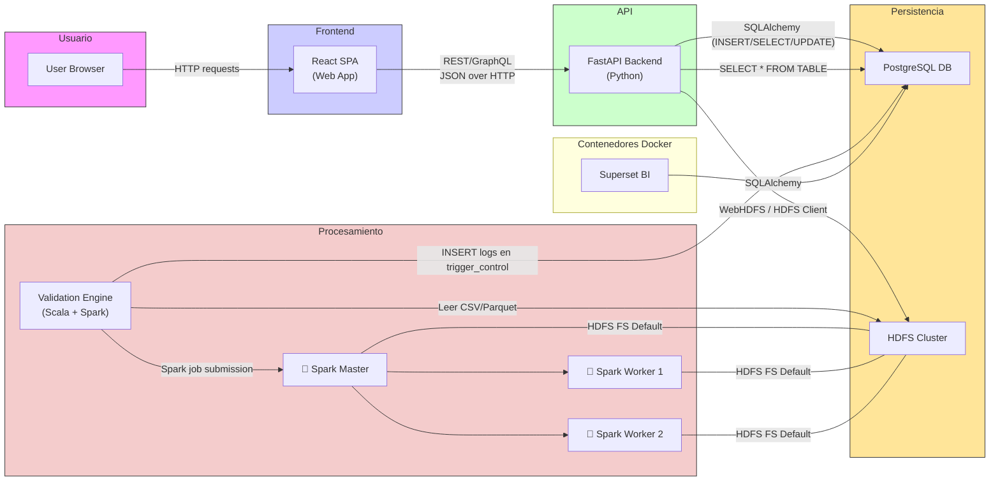

## 4. Implementación (GIT)

### 4.1 Diagrama de arquitectura


(Código de diagrama mermaid, renderizable en https://mermaid.js.org/)

* **Frontend (React + Vite)**
  * Usuario interactúa con la UI, llama rutas REST al backend y muestra datos.
* **Backend (FastAPI)**
  * Exposición de endpoints `/auth`, `/files`, `/files/logs`.
  * Usa **SQLAlchemy Async + AsyncPG** para comunicarse con PostgreSQL.
  * Utiliza **requests** para llamar a WebHDFS (NameNode/DataNode).
* **PostgreSQL**
  * Almacena `users`, `file_configuration`, `trigger_control`, `negative_flag_logs`.
  * Superset (opcional) también se conecta aquí para dashboards.
* **Motor Scala + Spark**
  * Se ejecuta como contenedor independiente, se conecta a HDFS (`hdfs://hadoop-namenode:9000`).
  * Procesa ficheros mediante Spark Streaming en modo batch y escribe logs en PostgreSQL mediante JDBC.
* **HDFS (NameNode/DataNode)**
  * Almacena CSV en `/data/bank_accounts`.
  * Motor de validaciones lee ficheros desde aquí y borra tras procesar.

*(Ver `docs/diagrama_arquitectura.png` para imagen detallada.)*

---

### 4.2 Tecnologías

A continuación se especifican todas las tecnologías y dependencias utilizadas en cada componente:

#### 4.2.1 Motor de validaciones (Scala + Spark)

* **Scala 2.12**
* **Apache Spark 3.x**
* **HDFS (Hadoop 3.x)**
* **SBT** (build tool de Scala)
* **Kryo** (serialización para Spark)
* **Docker** (OpenJDK 11-slim, bitnami/spark)
* **Docker Compose** (orquestación)

#### 4.2.2 Backend (FastAPI)

* **Python 3.12**
* **FastAPI >= 0.100.0**
* **Uvicorn\[standard] >= 0.23.0**
* **SQLAlchemy >= 2.0 (Async)**
* **asyncpg >= 0.28**
* **Pydantic Settings >= 2.0**
* **python-jose >= 3.3**
* **passlib\[bcrypt] >= 1.7**
* **requests >= 2.31**
* **python-dotenv >= 1.0**
* **Docker** (para ejecutar contenedores de backend en producción si se desea)

#### 4.2.3 Frontend (React)

* **React 18+**
* **React Router v6**
* **Axios**
* **Context API** (AuthContext)
* **Vite**
* **CSS puro**

#### 4.2.4 Base de datos y otros

* **PostgreSQL 13**
* **Kafka (opcional)**
* **Zookeeper (opcional)**
* **Superset** (opcional, para dashboards)
* **PlantUML** (diagramas de referencia)

---

### 4.3 Código (Explicación de las partes más interesantes)

Se destacan las implementaciones clave de cada componente.

#### 4.3.1 Motor de validaciones (Scala)

1. **`SparkSessionProvider.scala`**

    * Configura la `SparkSession` con parámetros personalizados:

      ```scala
      val spark = SparkSession.builder()
        .appName("ValidationEngine")
        .master("spark://spark-master:7077")
        .config("spark.serializer", "org.apache.spark.serializer.KryoSerializer")
        .config("spark.kryo.registrator", "com.mycompany.KryoRegistrator")
        .config("spark.hadoop.fs.defaultFS", "hdfs://hadoop-namenode:9000")
        .getOrCreate()
      ```
    * Ajusta particionamiento y directorios locales a través de `SPARK_LOCAL_DIRS`.

2. **`ExecutionManager.scala`**

    * Orquesta todas las validaciones:

      ```scala
      def executeFile(path: String, outputTable: String): Unit = {
        val df = Reader.readFile(spark, path)
        if (!FileSentinel.verifyFiles(df, metadata)) {
          logTrigger(flag, metadata, path)
          return
        }
        if (!TypeValidator.verifyTyping(df, metadata)) {
          logTrigger(flag, metadata, path)
          return
        }
        if (!ReferentialIntegrityValidator.verifyIntegrity(df, metadata)) {
          logTrigger(flag, metadata, path)
          return
        }
        FunctionalValidator.verifyFunctional(df, metadata) match {
          case Some(error) => 
            logTrigger(errorFlag, metadata, path)
            return
          case None => 
            logTrigger(2, metadata, path)
        }
        // Registrar en PostgreSQL
        Writer.writeToJdbc(df, outputTable, dbConfig)
        // Borrar de HDFS
        spark.sparkContext.hadoopConfiguration
          .delete(new Path(path), false)
      }
      ```
    * `logTrigger(flag, metadata, path)`: escribe un DataFrame con columns (`logged_at`, `file_config_id`, `file_name`, `field_name`, `environment`, `validation_flag`, `error_message`) y hace `df.write.mode("append").jdbc(...)`.

3. **Multi-Stage Dockerfile (`docker/Dockerfile.engine`)**

   ```dockerfile
   # Stage 1: Build con OpenJDK y SBT
   FROM openjdk:11-slim AS builder
   WORKDIR /app

   RUN apt-get update && apt-get install -y curl gnupg && \
       echo "deb https://repo.scala-sbt.org/scalasbt/debian all main" > /etc/apt/sources.list.d/sbt.list && \
       curl -sL "https://keyserver.ubuntu.com/pks/lookup?op=get&search=0x99E82A75642AC823" | apt-key add - && \
       apt-get update && apt-get install -y sbt && rm -rf /var/lib/apt/lists/*

   COPY ../project   project/
   COPY ../build.sbt build.sbt
   COPY ../src       src/
   COPY ../db.properties db.properties
   COPY ../src/main/resources/application.conf src/main/resources/

   RUN sbt clean assembly

   # Stage 2: Runtime Spark
   FROM bitnami/spark:3.3.1
   WORKDIR /app

   COPY --from=builder /app/target/scala-2.12/Fin_de_Grado-assembly-0.1.0-SNAPSHOT.jar app.jar
   COPY ../db.properties    db.properties
   COPY ../src/main/resources/application.conf application.conf

   ENV INPUT_DIR=/data/bank_accounts \
       OUTPUT_TABLE=trigger_control \
       POLL_INTERVAL_MS=10000 \
       SPARK_LOCAL_DIRS=/tmp/spark_local

   ENTRYPOINT spark-submit \
     --class Main \
     --master spark://spark-master:7077 \
     --deploy-mode client \
     --conf spark.driver.host=validation-engine \
     --conf spark.hadoop.fs.defaultFS=hdfs://hadoop-namenode:9000 \
     /app/app.jar
   ```

    * **Stage 1:** instala SBT, compila fat JAR con todas las dependencias.
    * **Stage 2:** parte de una imagen oficial de Spark; copia JAR, `db.properties` y `application.conf`; expone variables de entorno y lanza `spark-submit`.

4. **Script de reconstrucción (`scripts/rebuild_and_run.sh`)**

   ```bash
   #!/usr/bin/env bash
   set -euo pipefail

   # Construir el JAR con SBT
   sbt clean assembly

   # Crear red si no existe
   docker network create superset-net || true

   # Reconstruir y ejecutar solo el contenedor de validation-engine
   cd docker
   docker-compose build validation-engine
   docker-compose up --abort-on-container-exit validation-engine
   ```

    * Compila el JAR, crea la red `superset-net` y levanta únicamente el contenedor del motor de validaciones (asume que los demás servicios están corriendo).

---

#### 4.3.2 Backend (FastAPI)

1. **Configuración (`app/core/config.py`)**

   ```python
   from pydantic import BaseSettings

   class Settings(BaseSettings):
       postgres_user: str
       postgres_password: str
       postgres_host: str
       postgres_port: int
       postgres_db: str

       hdfs_host: str
       hdfs_port: int
       hdfs_dir: str
       hdfs_user: str
       hdfs_datanode_host: str
       hdfs_datanode_port: int

       upload_dir: str
       jwt_secret_key: str
       jwt_algorithm: str
       access_token_expire_minutes: int

       class Config:
           env_file = ".env"
   ```

    * Carga variables desde `.env` y construye `database_url = f"postgresql+asyncpg://{user}:{password}@{host}:{port}/{db}"`.

2. **Seguridad (`app/core/security.py`)**

   ```python
   from jose import JWTError, jwt
   from passlib.context import CryptContext
   from fastapi import Depends, HTTPException, status
   from fastapi.security import OAuth2PasswordBearer
   from sqlalchemy.ext.asyncio import AsyncSession
   from .config import Settings
   from app.db.models.user import UserModel

   pwd_context = CryptContext(schemes=["bcrypt"], deprecated="auto")
   oauth2_scheme = OAuth2PasswordBearer(tokenUrl="/auth/login")

   def verify_password(plain_password, hashed_password):
       return pwd_context.verify(plain_password, hashed_password)

   def get_password_hash(password):
       return pwd_context.hash(password)

   def create_access_token(subject: str, expires_delta=None):
       to_encode = {"sub": subject}
       # agregar expiración...
       encoded_jwt = jwt.encode(to_encode, Settings().jwt_secret_key, algorithm=Settings().jwt_algorithm)
       return encoded_jwt

   async def get_current_user(token: str = Depends(oauth2_scheme), db: AsyncSession = Depends(get_db)):
       credentials_exception = HTTPException(
           status_code=status.HTTP_401_UNAUTHORIZED,
           detail="No autenticado",
           headers={"WWW-Authenticate": "Bearer"},
       )
       try:
           payload = jwt.decode(token, Settings().jwt_secret_key, algorithms=[Settings().jwt_algorithm])
           user_id: str = payload.get("sub")
           if user_id is None:
               raise credentials_exception
       except JWTError:
           raise credentials_exception
       user = await db.get(UserModel, int(user_id))
       if user is None:
           raise credentials_exception
       return user
   ```

    * Define hashing de contraseñas, creación de JWT, y dependencia `get_current_user` que valida el token y extrae `sub`.

3. **Servicio de ficheros (`app/services/file_service.py`)**

   ```python
   import os
   from sqlalchemy.ext.asyncio import AsyncSession
   from app.db.models.file_configuration import FileConfigurationModel

   async def save_and_register_file(file, db: AsyncSession) -> int:
       upload_dir = Settings().upload_dir
       os.makedirs(upload_dir, exist_ok=True)
       file_path = os.path.join(upload_dir, file.filename)
       with open(file_path, "wb") as f:
           content = await file.read()
           f.write(content)
       result = await db.execute(select(FileConfigurationModel).where(FileConfigurationModel.file_name == file.filename))
       existing = result.scalar_one_or_none()
       if existing:
           # actualizar parámetros si vienen en request
           existing.some_field = ...
           await db.commit()
           return existing.id
       else:
           new_cfg = FileConfigurationModel(
               file_format="csv",
               path=upload_dir,
               file_name=file.filename,
               has_header=True,
               delimiter=",",
               quote_char='"',
               escape_char="\\",
               date_format="yyyy-MM-dd",
               timestamp_format="yyyy-MM-dd HH:mm:ss",
               partition_columns=None
           )
           db.add(new_cfg)
           await db.flush()
           return new_cfg.id
   ```

    * Guarda el CSV en disco local y crea/actualiza el registro en `file_configuration`.

4. **Servicio HDFS (`app/services/hdfs_sync.py`)**

   ```python
   import requests
   from fastapi import HTTPException
   from .config import Settings

   def push_file_to_hdfs(file_name: str):
       settings = Settings()
       local_path = os.path.join(settings.upload_dir, file_name)
       if not os.path.exists(local_path):
           raise HTTPException(status_code=404, detail=f"Local not found: {local_path}")

       # 1) MKDIRS
       mkdir_url = f"http://{settings.hdfs_host}:{settings.hdfs_port}/webhdfs/v1{settings.hdfs_dir}?op=MKDIRS&user.name={settings.hdfs_user}"
       resp = requests.put(mkdir_url)
       resp.raise_for_status()

       # 2) SETPERM
       perm_url = f"http://{settings.hdfs_host}:{settings.hdfs_port}/webhdfs/v1{settings.hdfs_dir}?op=SETPERM&permission=777&user.name={settings.hdfs_user}"
       resp = requests.put(perm_url)
       resp.raise_for_status()

       # 3) CREATE (NameNode → 307 → Location → DataNode)
       create_url = f"http://{settings.hdfs_host}:{settings.hdfs_port}/webhdfs/v1{settings.hdfs_dir}/{file_name}?op=CREATE&overwrite=true&user.name={settings.hdfs_user}"
       resp = requests.put(create_url, allow_redirects=False)
       location = resp.headers.get("Location")
       if not location:
           raise HTTPException(status_code=500, detail="HDFS create failed: no redirect")
       # Ajustar URL al DataNode
       upload_url = location.replace(f"{settings.hdfs_host}:{settings.hdfs_port}", f"{settings.hdfs_datanode_host}:{settings.hdfs_datanode_port}")
       with open(local_path, "rb") as f:
           resp2 = requests.put(upload_url, data=f)
           resp2.raise_for_status()
   ```

    * Gestiona la secuencia WebHDFS (MKDIRS, SETPERM, CREATE → 307 → PUT a DataNode).

5. **Rutas de archivos (`app/api/files.py`)**

   ```python
   from fastapi import APIRouter, Depends, UploadFile, File, HTTPException
   from sqlalchemy.ext.asyncio import AsyncSession
   from app.services.file_service import save_and_register_file
   from app.services.hdfs_sync import push_file_to_hdfs
   from app.db.session import get_db

   router = APIRouter(prefix="/files", tags=["files"])

   @router.post("/upload", status_code=201)
   async def upload_file(file: UploadFile = File(...), db: AsyncSession = Depends(get_db)):
       try:
           file_id = await save_and_register_file(file, db)
           return {"file_config_id": file_id}
       except Exception as e:
           raise HTTPException(status_code=500, detail=str(e))

   @router.post("/push/{file_name}")
   async def push_to_hdfs(file_name: str, user=Depends(get_current_user)):
       try:
           push_file_to_hdfs(file_name)
           return {"message": f"Pushed {file_name}"}
       except HTTPException as he:
           raise he
       except Exception as e:
           raise HTTPException(status_code=500, detail=str(e))

   @router.get("/")
   async def list_configs(db: AsyncSession = Depends(get_db)):
       result = await db.execute(select(FileConfigurationModel))
       configs = result.scalars().all()
       return configs

   @router.get("/{id}")
   async def get_config(id: int, db: AsyncSession = Depends(get_db)):
       cfg = await db.get(FileConfigurationModel, id)
       if not cfg:
           raise HTTPException(status_code=404, detail="Not found")
       return cfg

   @router.patch("/{id}")
   async def update_config(id: int, payload: FileConfigUpdate, db: AsyncSession = Depends(get_db)):
       cfg = await db.get(FileConfigurationModel, id)
       if not cfg:
           raise HTTPException(status_code=404, detail="Not found")
       for key, val in payload.dict(exclude_unset=True).items():
           setattr(cfg, key, val)
       await db.commit()
       return cfg

   @router.delete("/{id}", status_code=204)
   async def delete_config(id: int, db: AsyncSession = Depends(get_db)):
       cfg = await db.get(FileConfigurationModel, id)
       if not cfg:
           raise HTTPException(status_code=404, detail="Not found")
       await db.delete(cfg)
       await db.commit()

   @router.get("/download/{file_name}")
   async def download_file(file_name: str):
       file_path = os.path.join(Settings().upload_dir, file_name)
       if not os.path.exists(file_path):
           raise HTTPException(status_code=404, detail="File not found")
       return FileResponse(file_path, media_type="text/csv", filename=file_name)

   @router.get("/logs")
   async def get_logs(environment: str = None, from_date: date = None, to_date: date = None, db: AsyncSession = Depends(get_db)):
       query = select(TriggerControlModel)
       if environment:
           query = query.where(TriggerControlModel.environment == environment)
       if from_date:
           query = query.where(TriggerControlModel.logged_at >= from_date)
       if to_date:
           query = query.where(TriggerControlModel.logged_at <= to_date)
       result = await db.execute(query.order_by(TriggerControlModel.logged_at.desc()))
       logs = result.scalars().all()
       return logs
   ```

    * Endpoints para CRUD de configuraciones, subida, push a HDFS, descarga y consulta de logs.

---

#### 4.3.3 Frontend (React + Vite)

1. **Configuración de Axios (`src/api/axiosConfig.js`)**

   ```js
   import axios from 'axios';

   const api = axios.create({
     baseURL: 'http://localhost:8000',
   });

   // Interceptor de petición: añade token si existe
   api.interceptors.request.use(config => {
     const token = localStorage.getItem('access_token');
     if (token) {
       config.headers.Authorization = `Bearer ${token}`;
     }
     return config;
   });

   // Interceptor de respuesta: si 401, borrar token y redirigir
   api.interceptors.response.use(
     response => response,
     error => {
       if (error.response && error.response.status === 401) {
         localStorage.removeItem('access_token');
         alert('Tu sesión ha expirado. Por favor, inicia sesión de nuevo.');
         window.location.href = '/login';
       }
       return Promise.reject(error);
     }
   );

   export default api;
   ```

    * Gestiona token en cada petición y maneja 401 automáticamente.

2. **`AuthContext.jsx`**

   ```jsx
   import React, { createContext, useState, useEffect } from 'react';
   import { useNavigate } from 'react-router-dom';
   import api from '../api/axiosConfig';

   export const AuthContext = createContext();

   export const AuthProvider = ({ children }) => {
     const [token, setToken] = useState(localStorage.getItem('access_token'));
     const navigate = useNavigate();

     useEffect(() => {
       if (token) {
         localStorage.setItem('access_token', token);
       } else {
         localStorage.removeItem('access_token');
       }
     }, [token]);

     const login = async (email, password) => {
       const res = await api.post('/auth/login', { email, password });
       setToken(res.data.access_token);
       navigate('/dashboard');
     };

     const register = async (email, password) => {
       await api.post('/auth/register', { email, password });
       navigate('/login');
     };

     const logout = () => {
       setToken(null);
       navigate('/login');
     };

     return (
       <AuthContext.Provider value={{ token, login, register, logout }}>
         {children}
       </AuthContext.Provider>
     );
   };
   ```

    * Gestiona estado global de autenticación y métodos `login()`, `register()`, `logout()`.

3. **`AppRouter.jsx`**

   ```jsx
   import React, { useContext } from 'react';
   import { BrowserRouter, Routes, Route, Navigate, useLocation } from 'react-router-dom';
   import { AuthContext } from '../contexts/AuthContext';
   import LoginPage from '../pages/LoginPage';
   import RegisterPage from '../pages/RegisterPage';
   import Dashboard from '../pages/Dashboard';
   import LogsPage from '../pages/LogsPage';
   import MainLayout from '../layouts/MainLayout';

   const RequireAuth = ({ children }) => {
     const { token } = useContext(AuthContext);
     const location = useLocation();
     return token ? children : <Navigate to="/login" state={{ from: location }} replace />;
   };

   const AppRouter = () => (
     <BrowserRouter>
       <Routes>
         <Route path="/login" element={<LoginPage />} />
         <Route path="/register" element={<RegisterPage />} />
         <Route path="/" element={<RequireAuth><MainLayout /></RequireAuth>}>
           <Route index element={<Navigate to="/dashboard" replace />} />
           <Route path="dashboard" element={<Dashboard />} />
           <Route path="logs" element={<LogsPage />} />
         </Route>
         <Route path="*" element={<Navigate to="/login" replace />} />
       </Routes>
     </BrowserRouter>
   );

   export default AppRouter;
   ```

    * Define rutas públicas (`/login`, `/register`) y privadas (`/dashboard`, `/logs`) con `RequireAuth`.

4. **`Dashboard.jsx`**

   ```jsx
   import React, { useState, useEffect, useContext } from 'react';
   import { AuthContext } from '../contexts/AuthContext';
   import api from '../api/axiosConfig';
   import FileDetailModal from '../components/FileDetailModal';

   const Dashboard = () => {
     const [configs, setConfigs] = useState([]);
     const [selectedFile, setSelectedFile] = useState(null);
     const [uploading, setUploading] = useState(false);
     const [showModal, setShowModal] = useState(false);
     const [currentConfig, setCurrentConfig] = useState(null);

     const fetchConfigs = async () => {
       const res = await api.get('/files/');
       setConfigs(res.data);
     };

     useEffect(() => {
       fetchConfigs();
     }, []);

     const handleUpload = async () => {
       if (!selectedFile) return;
       setUploading(true);
       const form = new FormData();
       form.append('file', selectedFile);
       const res = await api.post('/files/upload', form);
       alert(`Fichero subido ID: ${res.data.file_config_id}`);
       fetchConfigs();
       setUploading(false);
     };

     const handleValidate = async (fileName) => {
       await api.post(`/files/push/${fileName}`);
       alert('Enviado a validar');
       fetchConfigs();
     };

     const handleDelete = async (id) => {
       if (!window.confirm('¿Estás seguro?')) return;
       await api.delete(`/files/${id}`);
       alert('Configuración eliminada');
       fetchConfigs();
     };

     return (
       <div>
         <h2>Dashboard</h2>
         <input type="file" onChange={e => setSelectedFile(e.target.files[0])} />
         <button onClick={handleUpload} disabled={uploading}>
           {uploading ? 'Subiendo...' : 'Subir Fichero'}
         </button>
         <table>
           <thead>
             <tr>
               <th>ID</th>
               <th>Fichero</th>
               <th>Has Header</th>
               <th>Delimiter</th>
               <th>Acciones</th>
             </tr>
           </thead>
           <tbody>
             {configs.map(cfg => (
               <tr key={cfg.id}>
                 <td>{cfg.id}</td>
                 <td>{cfg.file_name}</td>
                 <td>{cfg.has_header ? 'Sí' : 'No'}</td>
                 <td>{cfg.delimiter}</td>
                 <td>
                   <button onClick={() => handleValidate(cfg.file_name)}>Enviando…</button>
                   <button onClick={() => { setCurrentConfig(cfg); setShowModal(true); }}>Detalles</button>
                   <button onClick={() => handleDelete(cfg.id)}>Eliminar</button>
                 </td>
               </tr>
             ))}
           </tbody>
         </table>
         {showModal && (
           <FileDetailModal
             config={currentConfig}
             onClose={() => setShowModal(false)}
             onRefresh={fetchConfigs}
           />
         )}
       </div>
     );
   };

   export default Dashboard;
   ```

    * Subida de fichero, lista de configuraciones con acciones (Validar, Detalles, Eliminar).

5. **`FileDetailModal.jsx`**

   ```jsx
   import React, { useState } from 'react';
   import api from '../api/axiosConfig';

   const FileDetailModal = ({ config, onClose, onRefresh }) => {
     const [delimiter, setDelimiter] = useState(config.delimiter);
     const [quoteChar, setQuoteChar] = useState(config.quote_char);
     const [escapeChar, setEscapeChar] = useState(config.escape_char);
     const [hasHeader, setHasHeader] = useState(config.has_header);
     const [dateFormat, setDateFormat] = useState(config.date_format);
     const [timestampFormat, setTimestampFormat] = useState(config.timestamp_format);
     const [partitionColumns, setPartitionColumns] = useState(config.partition_columns);
     const [saving, setSaving] = useState(false);
     const [validating, setValidating] = useState(false);
     const [deleting, setDeleting] = useState(false);

     const save = async () => {
       setSaving(true);
       await api.patch(`/files/${config.id}`, {
         delimiter, quote_char: quoteChar, escape_char: escapeChar,
         has_header: hasHeader, date_format: dateFormat,
         timestamp_format: timestampFormat, partition_columns: partitionColumns
       });
       alert('Configuración actualizada');
       setSaving(false);
       onClose();
       onRefresh();
     };

     const validate = async () => {
       setValidating(true);
       await api.post(`/files/push/${config.file_name}`);
       alert('Enviado a validar');
       setValidating(false);
       onClose();
       onRefresh();
     };

     const downloadFile = async () => {
       const res = await fetch(`http://localhost:8000/files/download/${config.file_name}`, {
         headers: { Authorization: `Bearer ${localStorage.getItem('access_token')}` }
       });
       const blob = await res.blob();
       const url = URL.createObjectURL(blob);
       const a = document.createElement('a');
       a.href = url;
       a.download = config.file_name;
       a.click();
       URL.revokeObjectURL(url);
     };

     const remove = async () => {
       if (!window.confirm('¿Estás seguro?')) return;
       setDeleting(true);
       await api.delete(`/files/${config.id}`);
       alert('Configuración eliminada');
       setDeleting(false);
       onClose();
       onRefresh();
     };

     const overlayStyle = {
       position: 'fixed', top: 0, left: 0, right: 0, bottom: 0,
       backgroundColor: 'rgba(0,0,0,0.5)', display: 'flex',
       justifyContent: 'center', alignItems: 'center'
     };
     const modalStyle = {
       background: '#fff', padding: '1rem', borderRadius: '8px',
       position: 'relative', width: '500px'
     };

     return (
       <div style={overlayStyle} onClick={onClose}>
         <div style={modalStyle} onClick={e => e.stopPropagation()}>
           <h3>Detalles Fichero</h3>
           <label>Delimiter:</label>
           <select value={delimiter} onChange={e => setDelimiter(e.target.value)}>
             <option value=",">Comma</option>
             <option value=";">Semicolon</option>
             <option value="\t">Tab</option>
             <option value="|">Pipe</option>
           </select>
           <label>Quote Character:</label>
           <select value={quoteChar} onChange={e => setQuoteChar(e.target.value)}>
             <option value={'"'}>Double</option>
             <option value="'">Single</option>
             <option value="">None</option>
           </select>
           <label>Escape Character:</label>
           <select value={escapeChar} onChange={e => setEscapeChar(e.target.value)}>
             <option value="\\">Backslash</option>
             <option value={'"'}>Double</option>
             <option value="">None</option>
           </select>
           <label>Has Header:</label>
           <input type="checkbox" checked={hasHeader} onChange={e => setHasHeader(e.target.checked)} />
           <label>Date Format:</label>
           <select value={dateFormat} onChange={e => setDateFormat(e.target.value)}>
             <option value="yyyy-MM-dd">YYYY-MM-DD</option>
             <option value="dd/MM/yyyy">DD/MM/YYYY</option>
             <option value="MM-dd-yyyy">MM-DD-YYYY</option>
           </select>
           <label>Timestamp Format:</label>
           <select value={timestampFormat} onChange={e => setTimestampFormat(e.target.value)}>
             <option value="yyyy-MM-dd HH:mm:ss">YYYY-MM-DD HH:mm:ss</option>
             <option value="ISO 8601">ISO 8601</option>
             <option value="Timestamp MS">Timestamp MS</option>
           </select>
           <label>Partition Columns:</label>
           <input
             type="text"
             value={partitionColumns || ''}
             onChange={e => setPartitionColumns(e.target.value)}
           />
           <div style={{ marginTop: '1rem' }}>
             <button onClick={save} disabled={saving}>
               {saving ? 'Guardando...' : 'Guardar'}
             </button>
             <button onClick={validate} disabled={validating}>
               {validating ? 'Enviando…' : 'Validar'}
             </button>
             <button onClick={downloadFile}>Descargar</button>
             <button onClick={remove} disabled={deleting}>
               {deleting ? 'Eliminando…' : 'Eliminar'}
             </button>
           </div>
           <button onClick={onClose} style={{ position: 'absolute', top: '8px', right: '8px' }}>×</button>
         </div>
       </div>
     );
   };

   export default FileDetailModal;
   ```

    * Modal para editar parámetros, validar, descargar y eliminar configuración.

6. **`LogsPage.jsx`**

   ```jsx
   import React, { useState, useEffect } from 'react';
   import api from '../api/axiosConfig';

   const LogsPage = () => {
     const [logs, setLogs] = useState([]);

     const fetchLogs = async () => {
       const res = await api.get('/files/logs');
       setLogs(res.data);
     };

     useEffect(() => {
       fetchLogs();
     }, []);

     return (
       <div>
         <h2>Logs de Validación</h2>
         <table>
           <thead>
             <tr>
               <th>ID</th>
               <th>Config ID</th>
               <th>Fichero</th>
               <th>Campo</th>
               <th>Entorno</th>
               <th>Flag</th>
               <th>Mensaje</th>
               <th>Fecha</th>
             </tr>
           </thead>
           <tbody>
             {logs.map(l => (
               <tr key={l.id}>
                 <td>{l.id}</td>
                 <td>{l.file_config_id}</td>
                 <td>{l.file_name}</td>
                 <td>{l.field_name}</td>
                 <td>{l.environment}</td>
                 <td>{l.validation_flag}</td>
                 <td>{l.error_message}</td>
                 <td>{new Date(l.logged_at).toLocaleDateString('es-ES')}</td>
               </tr>
             ))}
           </tbody>
         </table>
       </div>
     );
   };

   export default LogsPage;
   ```

    * Muestra los logs de validación y formatea la fecha a español.

---

### 4.4 Organización del proyecto. Patrón

Se propone la siguiente estructura monolítica (tres carpetas principales), aunque cada componente puede colocarse en repositorios separados según conveniencia:

```
FileMonitoringSystem/
├── backend/                            ← Código FastAPI
│   ├── app/
│   │   ├── api/
│   │   │   ├── auth.py
│   │   │   ├── files.py
│   │   │   └── health.py
│   │   ├── core/
│   │   │   ├── config.py
│   │   │   └── security.py
│   │   ├── db/
│   │   │   ├── base.py
│   │   │   ├── session.py
│   │   │   └── models/
│   │   │       ├── user.py
│   │   │       ├── file_configuration.py
│   │   │       ├── semantic_layer.py      ← metadatos de campos
│   │   │       ├── trigger_control.py
│   │   │       └── negative_flag_logs.py
│   │   ├── services/
│   │   │   ├── file_service.py
│   │   │   └── hdfs_sync.py
│   │   └── schemas/
│   │       ├── auth.py
│   │       ├── files.py
│   │       └── logs.py
│   ├── main.py
│   ├── .env
│   ├── requirements.txt
│   └── test_api.sh
│
├── frontend/                           ← Código React + Vite
│   ├── public/
│   │   └── index.html
│   ├── src/
│   │   ├── api/
│   │   │   └── axiosConfig.js
│   │   ├── components/
│   │   │   └── FileDetailModal.jsx
│   │   ├── contexts/
│   │   │   └── AuthContext.jsx
│   │   ├── layouts/
│   │   │   └── MainLayout.jsx
│   │   ├── pages/
│   │   │   ├── Dashboard.jsx
│   │   │   ├── LoginPage.jsx
│   │   │   ├── RegisterPage.jsx
│   │   │   └── LogsPage.jsx
│   │   ├── routes/
│   │   │   └── AppRouter.jsx
│   │   ├── styles/
│   │   │   └── index.css
│   │   └── main.jsx
│   ├── package.json
│   └── README.md
│
├── engine/                             ← Motor de validaciones Scala + Spark
│   ├── docker/
│   │   ├── Dockerfile.engine
│   │   ├── Dockerfile.superset
│   │   └── docker-compose.yml
│   ├── docs/                           ← Diagramas PNG
│   │   ├── diagrama_casos_de_uso.png
│   │   ├── ERD.png
│   │   ├── diagrama_clases.png
│   │   ├── diagrama_secuencia.png
│   │   └── ...
│   ├── scripts/
│   │   └── rebuild_and_run.sh
│   ├── src/
│   │   ├── main/
│   │   │   ├── resources/
│   │   │   │   ├── application.conf
│   │   │   │   ├── db.properties
│   │   │   │   └── files/                ← Scripts Python para generar CSV de prueba
│   │   │   └── scala/
│   │   │       ├── Main.scala
│   │   │       ├── config/
│   │   │       │   ├── DbConfig.scala
│   │   │       │   ├── DBConnection.scala
│   │   │       │   └── SparkSessionProvider.scala
│   │   │       ├── models/
│   │   │       │   ├── FileConfigurationCaseClass.scala
│   │   │       │   └── SemanticLayerCaseClass.scala
│   │   │       ├── services/
│   │   │       │   ├── ExecutionManager.scala
│   │   │       │   └── TriggerIdManager.scala
│   │   │       ├── utils/
│   │   │       │   ├── Reader.scala
│   │   │       │   ├── Writer.scala
│   │   │       │   └── FileManager.scala
│   │   │       └── validators/
│   │   │           ├── FileSentinel.scala
│   │   │           ├── TypeValidator.scala
│   │   │           ├── ReferentialIntegrityValidator.scala
│   │   │           └── FunctionalValidator.scala
│   │   ├── test/scala/                 ← Pruebas unitarias (ScalaTest)
│   │   └── build.sbt
│   └── README-cluster.md               ← Guía de cluster Hadoop/Spark/Kafka/Superset
│
├── docs/                               ← Carpeta MkDocs (documentación “libro”)
│   ├── 01-introduccion.md
│   ├── 02-requisitos.md
│   ├── 03-diseno.md
│   ├── 04-implementacion.md
│   ├── 05-resultado.md
│   ├── 06-conclusiones.md
│   └── img/
│       ├── diagrama_casos_de_uso.png
│       ├── ERD.png
│       ├── diagrama_clases.png
│       ├── diagrama_secuencia.png
│       └── ... (otros PNG)
│
├── mkdocs.yml                          ← Configuración de MkDocs
├── .github/
│   └── workflows/
│       └── mkdocs-deploy.yml           ← GitHub Action para desplegar en Pages
│
└── README-cluster.md                   ← Guía de cluster (si quieres)  
```

* El patrón es **feature-based**: cada carpeta agrupa archivos según responsabilidad (API, servicios, modelos, diagramas, etc.).
* Cada componente puede versionarse por separado y luego combinarse en un monorepo si se desea.

---
